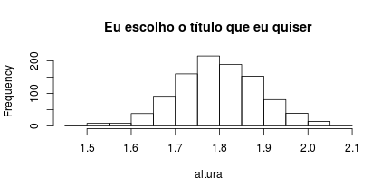
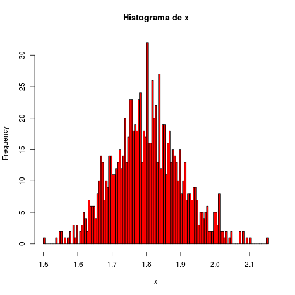

# R como calculadora

A linguagem do R é um tanto quanto intuitiva, muita coisa sai do jeito certo no chute! Para ver um exemplo disso, é interessante começar fazendo do R uma grande calculadora. Tente jogar no console `2*2 - (4 + 4)/2`. Pronto. Com essa simples expressão você já é capaz de imaginar (e certeiramente) como pedir ao R para fazer qualquer tipo de operação aritmética. Lição aprendida!

Além do mais, as operações e suas precedências são mantidas como na matemática, ou seja, divisão e multiplicação são calculadas antes da adição e subtração. E os parênteses nunca são demais!

Falando em matemática, o $\pi$ já vem definido!


```r
pi
```

```
## [1] 3.141593
```

```r
sin(pi/2) + 2*3
```

```
## [1] 7
```

```r
(sin(pi/2) + 2)*3
```

```
## [1] 9
```

Veja que apareceu a função `sin()`, o famoso seno. Tente outras funções trigonométricas para ver se acerta de prima!

Mas a ideia é essa. Ser intuitivo. A dica aqui é tentar! No R, um erro não é nenhuma dor de cabeça, é rápido consertar e testar (**debugar**, para os mais íntimos).

## Valores especiais

Certas operações matemáticas podem suscitar em valores não numéricos. Exemplo disso são log de números negativos e divisões por zero. Para tais operações, o R reservou valores especiais para serem retornadas quando operações não resultarem em um número propriamente dito. A tabela abaixo lista esses objetos:


## Operadores aritméticos

Os bons e conhecidos operadores aritméticos. Com números reais eles funcionam como na matemática, mas ao saírmos da reta, eles podem fazer muito mais!


|   Operador    |              Descrição               |
|:-------------:|:------------------------------------:|
|     x + y     |          Adição de x com y           |
|     x - y     |         Subtração de y em x          |
|    x \* y     |        Multiplicação de x e y        |
|     x / y     |          Divisão de x por y          |
| x^y ou x\*\*y |     x elevado a y-ésima potência     |
|     x%%y      | Resto da divisão de x por y (módulo) |
|     x%/%y     | Parte inteira da divisão de x por y  |

Exemplos:

```r
1 + 1
```

```
## [1] 2
```

```r
10 - 8
```

```
## [1] 2
```

```r
2*10
```

```
## [1] 20
```

```r
18/3
```

```
## [1] 6
```

```r
2^4
```

```
## [1] 16
```

```r
9%%2
```

```
## [1] 1
```

```r
9%/%2
```

```
## [1] 4
```
## Operadores lógicos

Operadores lógicos retornarão sempre ou `TRUE` ou `FALSE`. Eles definem perguntas que aceitam apenas verdadeiro e falso como resposta, como sugere o quadro abaixo.


|  operador  |                 descricao                 |
|:----------:|:-----------------------------------------:|
|   x < y    |              x menor que y?               |
|   x <= y   |           x menor ou igual a y?           |
|   x > y    |              x maior que y?               |
|   x >= y   |           x maior ou igual a y?           |
|   x == y   |               x igual a y?                |
|   x != y   |             x diferente de y?             |
|     !x     |               Negativa de x               |
|   x | y    |          x ou y são verdadeiros?          |
|   x & y    |          x e y são verdadeiros?           |
| xor(x, y)  | x ou y são verdadeiros (apenas um deles)? |

Exemplos:

|          Teste           |  Resposta  |
|:------------------------:|:----------:|
|          1 < 1           |   FALSE    |
|          1 <= 1          |    TRUE    |
|        1 == 0.999        |   FALSE    |
| 1 == 0.99999999999999999 |    TRUE    |
|       13.5 != 13.5       |   FALSE    |
|          !TRUE           |   FALSE    |
|       TRUE | FALSE       |    TRUE    |
|      FALSE | FALSE       |   FALSE    |
|       TRUE & FALSE       |   FALSE    |
|       TRUE & TRUE        |    TRUE    |
|     xor(TRUE, TRUE)      |   FALSE    |
|     xor(TRUE, FALSE)     |    TRUE    |
|        TRUE == 1         |    TRUE    |
|        TRUE == 2         |   FALSE    |
|        FALSE == 0        |    TRUE    |

## Números complexos

O R manipula números complexo de maneira fácil e intuitiva do mesmo jeito que trata os números reais. Além disso, disponibiliza funções úteis para eles, como módulo, conjugado e argumento.


```r
x <- -8 + 0i

# verifica se x é um número commplexo
class(x)
```

```
## [1] "complex"
```

```r
is.complex(x)
```

```
## [1] TRUE
```

A tabela abaixo resume algumas funções interessantes para números complexos.


|  Função  |        Descrição        |
|:--------:|:-----------------------:|
|  Re(z)   |     Parte real de x     |
|  Im(z)   |  Parte imaginária de x  |
|  Mod(z)  |       Módulo de x       |
|  Arg(z)  |     Argumento de x      |
| Conj(z)  | Complexo conjugado de x |

Demais funções matemáticas, como logaritmo, funções trigonométricas, exponencial e radiciação também estão implementadas para números complexos.

# Controle de fluxo (*flow controls*)

## Sumário

- if, else, else if: testa uma condição
- for, while: "laços" ou iterações
- break, next: ações dentro de laços

## if, else e else if

### Estrutura:


```r
if(<condição1>) {
  # se a condição1 for verdadeira...
  # faz coisas interessantes.
} else if (<condição2>) {
  # caso a condição1 seja falsa e a condição2 seja verdadeira...
  # faz coisas legais para este caso.
} else {
  # faz coisas necessárias caso todas as condições anteriores falharem
}
```

As condições devem ser expressões lógicas, ou seja, testes que retornem `TRUE` ou `FALSE`. Assim, o código entre `{}` será executado se a condição for `TRUE` ou será ignorada se a condição retornar `FALSE`.

### Exemplo:


```r
x <- 4

# teste: x NÃO é um número?
!is.numeric(x)
```

```
## [1] FALSE
```

```r
# teste: x é menor que zero?
x < 0
```

```
## [1] FALSE
```

```r
# teste: x é maior que zero?
x > 0
```

```
## [1] TRUE
```

```r
if(!is.numeric(x)) {
  "x não é um número"
} else if(x > 0) {
  "x é positivo"
} else if(x < 0) {
  "x é negativo"
} else {
  "x é nulo"
}
```

```
## [1] "x é positivo"
```

O que acontece no exemplo acima, passo a passo:

1. A expressão `!is.numeric(x)` testa se `x` NÃO é um número. Como `x` vale 4, ele retorna `FALSE`. Assim, a expressão `{"x não é um número"}` não é executada e a próxima condição é testada;

2. No primeiro `else if`, o teste lógico `x > 0` retorna `TRUE`, fazendo com que a expressão `{"x é positivo"}` seja executada e todo o restante dos testes, ignorado.

**OBS:** a condições `x < 0` nunca chegou a ser testada. Uma vez encontrada uma condição verdadeira, o programa executa o respectivo bloco de códigos entre `{}` e descarta as demais instruções.

### Considerações:

- O `else` e o `else if` têm que estar na mesma linha do `}` da expressão anterior, senão não rodará!


```r
# Certo
if(1 == 2) {
  "Um resultado muito interessante!"
} else { # <----- Mesma linha que o "}"
  "1 é diferente de 2"
}

# ERRADO!!! Não rodará
if(1 == 2) {
  "Um resultado muito interessante!"
}
else { # <----- Na linha abaixo do "}"
  "1 é diferente de 2"
}
```

- Além de `TRUE` e `FALSE`, o R aceita `1` e `0`, respectivamente. Na verdade, não precisa ser `1` exatamente, a regra é: 
    - número diferente de zero é `TRUE`; e 
    - número igual a zero é `FALSE`.
    
- Objetos `character`, `NA`, `NaN` e `list` não são interpretáveis como lógicos. Será retornado um erro caso tente passá-los como condições.

- Caso seja passado um `array`, `vector` ou `matrix`, será utilizado apenas o primeiro elemento (é melhor evitar usar arrays como condições!). Será enviado um aviso de que isso ocorreu.

- `else` e `else if` são opcionais.

## for

O `for` é um tipo "laço" (*loop*, em inglês) que aplica um bloco de código para um número fixo de iterações. Geralmente, um `for` percorre um vetor e utiliza um elemento diferente deste vetor em cada iteração.

### Estrutura:


```r
for(iterador in <sequencia>) {
  # Fazer algo para cada item da <sequencia>
  # pode ter outros for's aqui dentro!
}
```

### Exemplo:

O uso mais simples é quando iteramos em um vetor de inteiros, como se fossem contadores.

```r
for(i in 1:5) {
  print(i)
}
```

```
## [1] 1
## [1] 2
## [1] 3
## [1] 4
## [1] 5
```

Mas podemos iterar em um vetor qualquer.


```r
frutas <- c("banana", "uva", "abacaxi")

# Brincadeira da <fruta> + "guei"
for(fruta in frutas) {
  print(paste(fruta, "guei", sep = ""))
}
```

```
## [1] "bananaguei"
## [1] "uvaguei"
## [1] "abacaxiguei"
```

Para cada item do vetor `frutas`, o `for` atribuiu ao objeto `fruta` o valor do respectivo item e aplicou a função `print(paste(fruta, "guei", sep = ""))`.

Formas alternativas com o mesmo comportamento que o acima:

```r
# repare nos []'s depois do vetor 'frutas'
for(i in 1:length(frutas)) {
  print(paste(frutas[i], "guei", sep = ""))
}

# seq_along() é uma função especialmente útil para for's
for(i in seq_along(frutas)) {
  print(paste(frutas[i], "guei", sep = ""))
}
```

**OBS** Apesar de parecer mais 'elegante' atribuir diretamente os valores ao iterador (como no caso do `fruta in frutas`), muitas vezes você se pegará na necessidade de usar os índices dos valores. Casos típicos é quando se tem um outro vetor que faz relação com outro. O exemplo abaixo não seria possível caso utilizássemos `fruta in frutas` no lugar de `i in seq_along(frutas)`.


```r
# Exemplo simples de quando é util utilizar índice em vez de valor.
frutas1 <- c("banana", "uva", "abacaxi")
frutas2 <- c("kiwi", "uva", "laranja")
pessoas <- c("Amanda", "Bruno", "Caio")

for(i in seq_along(frutas1)) {
  if(frutas1[i] == frutas2[i]) {
    frutas1[i] <- "manga" # Troca a fruta 1
    print(paste(pessoas[i], "ganhou frutas repetidas. Uma delas foi trocada por manga."))
  }
}
```

```
## [1] "Bruno ganhou frutas repetidas. Uma delas foi trocada por manga."
```

### *ifelse()*: *for* com *if else*

Como veremos mais para frente, vetores são quase sempre bem-vindos no R. Muitas funções trabalham com vetores de maneira muito conveniente e a função `ifelse()` é um exemplo disso. Ela é a abordagem mais simples quando queremos que cada elemento de um vetor passe por algum teste lógico (como no exemplo acima) para retornar um valor dependendo se a condiçao for `TRUE` ou `FALSE` (como nunca é demais, dê um `?ifelse` para ver a documentação se for preciso). Abaixo está a replicação do exemplo acima, mas sem a mensagem de aviso.


```r
frutas1 <- c("banana", "uva", "abacaxi")
frutas2 <- c("kiwi", "uva", "laranja")
pessoas <- c("Amanda", "Bruno", "Caio")

frutas1 <- ifelse(frutas1 == frutas2, "manga", frutas1)
```

O código acima está dizendo que se os respectivos elementos de frutas1 e frutas2 calharem de serem iguais, então substitua por "manga". Se forem diferentes, então mantenha a fruta 1 original. Finalmente, atualize o vetor `frutas1`.

Na parte de vetorização será descrita com mais detalhe o que está acontecendo por trás dos panos.

### Considerações:

O uso do *for*, ao contrário das outras linguagens de programação, se tornará cada vez menos frequente conforme você for se aprimorando no R. Ele é especialmente ineficiente no R e, além disso, existem outras funções que o substituem e ainda facilitam muito mais a vida.

## while

O laço `while` é especialmente útil quando não sabemos quando iremos parar (a condição para o laço deixar de rodar pode envolver o acaso ou convergência, por exemplo). Cuidado com os *loops* infinitos! =)

### Estrutura:

A estrutura é muito similar ao `if`. Tem a condição (ou teste lógico) e a expressão a ser executada enquanto a condição for verdadeira.


```r
while(<condições>) {
  # coisas para fazzer enquanto as <condições> forem TRUE
}
```

### Exemplo:
Abaixo está uma simulação de lançamento de moedas do qual se tem interesse em saber quantos lançamentos foram necessários até o aparecimento de uma "cara".

```r
p <- 0.2 # probabilidade de cair "cara"
lances <- 0 # contador de lançamentos
while(runif(1) > p) {
  lances <- lances + 1
}

lances
```

```
## [1] 3
```

A função `runif(1)` gera um número aleatório no intervalo unitário toda vez que a condição é avaliada. Se este número for maior que `p`, então a moeda e lançada novamente e o contador de lançamentos é incrementado em uma unidade e esse ciclo se repete até que, por acaso, o número sorteado seja menor que `p`. No fim, teremos nossa desejada variável aleatória simulada de lances até "cara".

Repare que enquanto a condição retornava `TRUE`, a expressão sera reexecutada. O laço só parou quando a condição retornou `FALSE`. Essa é a regra do `while`.

# Vetorização

Vetores no R são cadeias ordenadas de elementos (geralmente números ou palavras) e são os objetos de maior interesse porque são eles que guardam os dados a serem analisados. Por essa razão que quase tudo feito no R aceita de braços abertos um "vetor" (entre aspas por que "vetor" aqui pode ser vetor, matriz, tabela e afins, tipos de objetos que serão explicados em detalhes na próxima aula).

Se você é novo no mundo da programação, não vai sentir muito a vantagem desse conceito. Aos que já estão acostumados a programar em outras lingaguens de programação, se verão tentados a usar *loops* para tudo. Isso terá de mudar (e irá, naturalmente). Como frisado anteriormente, *loops* no R são sofrivelmente ineficientes.

## Tecnicalidades

Tecnicamente, vetorização nada mais é do que a cultura de se criar e usar funções vetorizadas. Essas funções recebem vetor(es) [x1, ..., xn] e devolvem vetor(es) [f(x1), ..., f(xn)]. Mas por quê é importante, afinal?

Implementar funções vetorizadas seria uma tarefa simples, não fosse a lentidão dos *loops*. No R, funções vetorizadas realmente úteis são implementadas nas linguagens de baixo nível, que são muito mais rápidas. Por isso, a não ser que domine C, FORTRAN ou C++, você ficará dependente das funções vetorizadas disponíveis pelo R ou por terceiros.

## Eficiência

Abaixo está um exemplo que mostra a diferença de tempo que leva para calcular a raiz quadrada de cada elemento de um vetor de números. 

- Uma das funções está implementada inteiramente em R utilizando um *for* para calcular a raiz quadrada em cada elemento do vetor por meio da função `sqrt()`;
- Uma segunda maneira de efetuar a mesma operação tira proveito da implementação vetorizada em C da função `sqrt()`.


```r
x <- 1:1000000 # sequência de inteiros de 1 a 1000000

# função que calcula a raiz quadrada de cada elemento de um vetor de números
meu_sqrt <- function(numeros) {
  resp <- numeric(length(numeros))
  for(i in seq_along(numeros)) {
    resp[i] <- sqrt(numeros[i])
  }
  return(resp)
}

# Comparação de eficiência entre função vetorizada e função "vetorizada no R"
system.time(x2a <- meu_sqrt(x))
```

```
##    user  system elapsed 
##   1.542   0.000   1.528
```

```r
system.time(x2b <- sqrt(x))
```

```
##    user  system elapsed 
##   0.000   0.000   0.009
```

```r
# Verifica que os dois vetores são iguais
identical(x2a, x2b)
```

```
## [1] TRUE
```

Um ganho de 100-200 vezes na eficiência! E as vantagens não param por aí:

1. Essas funções foram construídas e testadas por pessoas que ganham a vida fazendo isso;
2. No R, uma função é "esperta" e funciona para diferentes tipos de objetos que passamos a ela, muitas vezes da forma que esperamos.

## Reciclagem

Um conceito que caminha junto com a vetorização é a chamada Reciclagem. Um exemplo ajuda a esclarecer o que isso significa.


```r
x <- c(1,5)
y <- c(1,10,100,1000)
x + y
```

```
## [1]    2   15  101 1005
```

Neste exemplo estamos somando dois vetores de tamanhos diferentes. Na matemática isso não faz sentido, mas no R faz! E qual convenção se usa para que essa operação seja bem definida? A resposta é Reciclagem. O operador `+` é uma função vetorizada e que está programado para lidar com quase qualquer tipo de soma que o usuário queira desafiá-lo a fazer. Ao ser incumbido da árdua missão de somar dois vetores de tamanhos diferentes, o `+` "recicla" os valores do menor vetor, no caso o vetor `x`, reutilizando seus valores até preencher o vetor maior. 

Esta convenção aparece sempre que possível no R e vale tomar cuidado: há vezes em que o R não avisa que reciclou valores.

# Funções

Funções são grandes trunfos das linguagens de programação. Função no R tem a mesma finalidade das funções das demais linguagens: evitar repetir códigos e construir abstrações. Funções deixam o código mais legível, elegante e menos repetitivo. Além disso, funções abstraem uma rotina para casos mais gerais por meio de parâmetros, fazendo-a útil para casos além daquela configuração específica que motivou sua implementação.

## Estrutura


```r
nome_da_funcao <- function(<parâmetros>) {
  # faz coisas com os parâmetros
  resultado
}

# uso da função
nome_da_funcao(param1, param2, ...)
```

Pontos relevantes:

- Funções também são objetos! Aliás, tudo que você atribui com `<-` vira um objeto no R. Assim, é natural pensar que funções podem receber outras funções como argumento e isso é bem comum.

- Assim que uma função for atribuída a um objeto, use esta função como se ela tivesse vinda com o R: `nome_da_funcao(...)`.

## Parâmetros

Funções aceitam quaisquer e quantos parâmetros precisar e retorna um objeto, de qualquer tipo, inclusive nada (`NULL`). No lugar do `<parâmetros>` você pode colocar nomes que servirão de objetos (número, texto, vetor, lista, etc.) dentro da sua função.

### Parâmetros opcionais
Parâmetros são objetos cujos valores devem ser atribuídos pelo usuário. Porém, existem parâmetros opcionais, que assumem um dado valor padrão caso o usuário opte por não especificar explicitamente.


```r
# função que ecoa uma palavra
ecoar <- function(palavra, n_ecos = 3) {
    paste(c(rep(palavra, n_ecos), "!"), collapse = " ")
}
```

### Parâmetros relativos
Além de parâmetros opcionais, podem existir parâmetros cujo valor padrão usa o valor de outro parâmetro. Exemplo:


```r
# Função que desenha um histograma
histograma <- function(numeros, xlab = "x", titulo = paste("Histograma de", xlab)) {
  hist(numeros, xlab = xlab, main = titulo)
}

# Simula 1000 medidas de altura de pessoas de uma Normal com média 1,80 e desvio padrão de 0,1.
altura <- rnorm(n = 1000, mean = 1.80, sd = 0.1)
histograma(altura, "altura")
```

 

```r
histograma(altura, "altura", "Eu escolho o título que eu quiser")
```

 

O parâmetro `xlab` define o título do eixo x enquanto `titulo` escreve o título principal do gráfico. Este último irá utilizar o nome passado para o eixo x para criar o seu valor padrão.

### Ordem ou nome
Podemos passar valores aos parâmetros explicitamente ou implicitamente. Passar valor explicitamente significa associar o valor desejado ao nome do parâmetro. Por exemplo, no código `rnorm(n = 1000, mean = 1.80, sd = 0.1)` está claro qual valor será passado para cada parâmetro. Se quisermos omitir os nomes dos parâmetros, as funções terão a boa vontade de deduzir a qual parâmetro você deseja atribuir certo valor e isso é feito utilizando a ORDEM dos parâmetros definidos na criação da função. No comando `histograma(altura, "altura")` nenhum parâmetro foi diretamente definido, mas pela ordem, o vetor `altura` foi atribuído ao parâmetro `numeros` e a *string* `"altura"` foi atribuída ao parâmetro `xlab` da função `histograma()`. A versão "explícita" desse comando seria `histograma(numeros = altura, xlab = "altura")`.

**OBS:** Misturar as formas, explícitas e implícitas, também funciona e versões explícitas aceitam que os parâmetros sejam passados fora de ordem. A expressão `histograma(xlab = "altura", altura)` daria certo também!

**OBS 2:** Se não for ambíguo, o R aceita que apenas parte do nome do parâmetro seja passado. No nosso exemplo, `histograma(altura, t = "Eu escolho o título que eu quiser", x = "altura")` levaria ao mesmo resultado que todos os citados até aqui.

### Parâmetro "..."

Existe um parâmetro especial e frequentemente disponível em funções que é simbolizado por três pontinhos "...". Esse argumento indica que pode ser passado um número variável de parâmetros e que, geralmente, estes serão repassados para outras funções. 

Uma utilidade é quando você deseja fazer possível mexer nos parâmetros de uma função, mas não quer copiar todos os seus parâmetros novamente. Retomemos o exemplo da função `histograma()`:


```r
histograma <- function(numeros, xlab = "x", titulo = paste("Histograma de", xlab), ...) {
  hist(numeros, xlab = xlab, main = titulo, ...)
}

histograma(altura, breaks = 100, col = 2)
```

 

Repare que nunca precisamos definir os parâmetros `breaks` e `col` na função `histograma()`. O ... fez o trabalho de enviar essas informações à função `hist()`.

Um segundo cenário que ... se faz útil é quando uma função aceita um número indefinido de argumentos. Um exemplo disso é a função `paste()`, que concatena palavras. A ela, podemos passar quantas palavras quisermos. Não fosse o ..., teríamos que ter os parâmetros `(palavra1, palavra2, palavra3, ...)`. Sem chances.


```r
args(paste)
```

```
## function (..., sep = " ", collapse = NULL) 
## NULL
```

```r
paste("Eu", "sou", "o", "capitão", "planeta")
```

```
## [1] "Eu sou o capitão planeta"
```

## Funções anônimas

As funções anônimas são frequentemente utilizadas e têm essa denominação pois não nos damos o trabalho de defini-las como um objeto permanente no nosso ambiente de trabalho. Veja o exemplo abaixo:


```r
nums <- 1:10

eh_par <- sapply(nums, function(numero) {numero %% 2 == 0})

cbind(nums, eh_par) 
```

```
##       nums eh_par
##  [1,]    1      0
##  [2,]    2      1
##  [3,]    3      0
##  [4,]    4      1
##  [5,]    5      0
##  [6,]    6      1
##  [7,]    7      0
##  [8,]    8      1
##  [9,]    9      0
## [10,]   10      1
```

Não se preocupe em entender tudo o que o código acima está fazendo, você aprenderá adiante tudo sobre a função `sapply()` e `cbind()`. O ponto deste exemplo está na parte `function(numero) {numero %% 2 == 0}`. Este pedaço de código define uma função, mas essa função não tem nome! Apesar disso, ela continua sendo um objeto e pode ser passada como parâmetro de função, assim como faríamos com números, textos e vetores. Caso a função fosse útil em outros contextos ou tivesse que ser repetida em outra parte do código, poderíamos guardá-la no ambiente de trabalho, como mostra o exemplo que segue:


```r
testa_se_eh_par <- function(numero) {
  numero %% 2 == 0
}

eh_par <- sapply(nums, testa_se_eh_par)
```

O resultado é idêntico como deveria ser, mas agora a função tem nome e pode ser utilizada conforme a conveniência.

# Variáveis Aleatórias

No R é muito fácil calcular f.d.p's, f.d.a's, quantis e até mesmo simular variáveis aleatórias das mais consagradas distribuições de probabilidade. O nome dessas funções segue um padrão que chamamos de funções (d, p, q, r). Exemplo para a distribuição Normal:


```r
dnorm(x, mean = 0, sd = 1, log = FALSE)
pnorm(q, mean = 0, sd = 1, lower.tail = TRUE, log.p = FALSE)
qnorm(p, mean = 0, sd = 1, lower.tail = TRUE, log.p = FALSE)
rnorm(n, mean = 0, sd = 1)
```

Repare nas 4 letras que antecedem `norm` nos nomes das funções. Essas letras significam:

- **d** ("density") Densidade da Normal, ou f.d.p da Normal;
- **p** ("probability") Função de distribuição acumulada (f.d.a) da Normal;
- **q** ("quantile") Quantil da Normal;
- **r** ("random") Gera um número vindo de uma Normal.

No lugar de `norm`, você pode trocar por outra distribuição de probabilidade. A tabela abaixo lista algumas das possibilidades:


|  Distribuição  |  Apelido  |
|:--------------:|:---------:|
|     Normal     |   norm    |
|    Uniforme    |   unif    |
|      Beta      |   beta    |
|  Chi Quadrado  |   chisq   |
|  Exponencial   |    exp    |
| F de Snedecor  |     f     |
|      Gama      |   gamma   |
|    Poisson     |   pois    |

Para consultar a lista completa de distribuições da família (d, p, q, r), rode no console `?Distributions`.

# Vocabulário


## Trigonometria


|           Função            |            Descrição            |
|:---------------------------:|:-------------------------------:|
|  cos(x) / sin(x) / tan(x)   |   seno/cosseno/tangente de x    |
| acos(x) / asin(x) / atan(x) | arco-seno/cosseno/tangente de x |

## Matemática


|    Função    |        Descrição        |
|:------------:|:-----------------------:|
|    log(x)    | Logaritmo natural de x  |
|    exp(x)    |      e elevado a x      |
|    abs(x)    |   valor absoluto de x   |
|   sign(x)    |  sinal de x (1 ou -1)   |
|   sqrt(x)    |   raiz quadrada de x    |
| choose(n, k) | combinações de n, k a k |
| factorial(x) |      fatorial de x      |

## Estatística


|        Função         |                  Descrição                  |
|:---------------------:|:-------------------------------------------:|
|        mean(x)        |                 Média de x                  |
|    var(x) / sd(x)     |   Variância / Desvio Padrão amostral de x   |
|      quantile(x)      |                Quantis de x                 |
| cov(x, y) / cor(x, y) | Covariância / Correlação linear entre x e y |

## Diversos


|  Função  |                 Descrição                  |
|:--------:|:------------------------------------------:|
|   x:y    |            Sequencia de x até y            |
|   x=y    |          x recebe y (atribuição)           |
|    ?x    |             documentação de x              |
|   x$y    |         extração de y do objeto x          |
|  x%\*%y  | Multiplicação matricial das matrizes x e y |

# Referências

http://adv-r.had.co.nz/Functions.html

http://www.burns-stat.com/pages/Tutor/R_inferno.pdf

# Próxima aula

