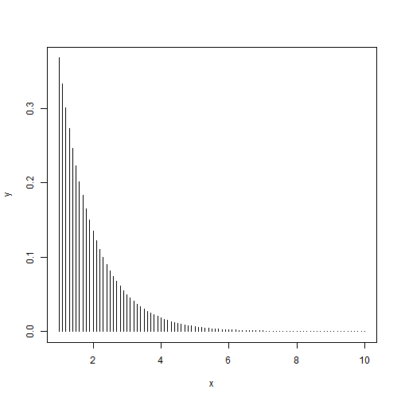
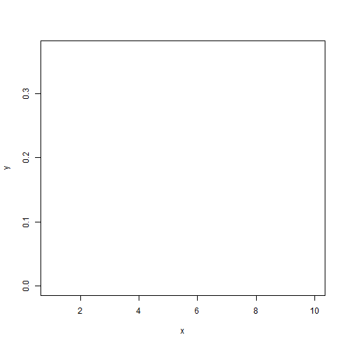
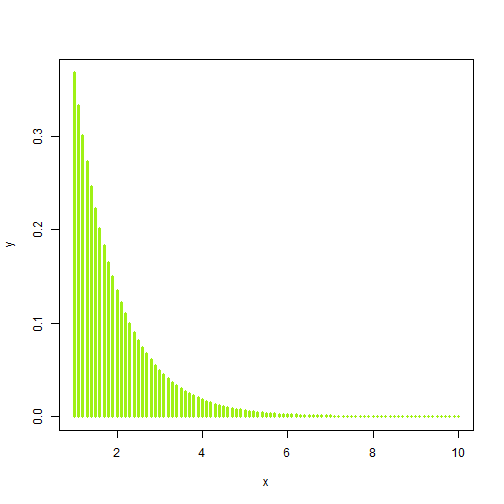

---
title: Aula 02 - Estruturas de Dados e Vocabulário
date : 2015-01-21
--- 

# Estruturas de dados no R

Tipos básicos de estrutura no R:

- **Atomic vector**: homogêneo e unidimensional
- **Matriz**: homogêneo e bidimensional
- **Array**: homogêneo e multidimensional
- **Lista**: heterogêneo e unidimensional
- **Data frame**: heterogêneo bidimensional


**Nota**: em sua implementação, atomic vectors e matrizes são também arrays e data frames são listas.


## Atomic Vectors

Atomic vectors são a estrutura de objetos mais simples do R, caracterizados por "não terem dimensão".

Tipos de atomic vectos:

- lógico
- integer
- double
- complexo
- character

Exemplos:


```r
dbl_var <- c(1, 2.5, 4.5) #DOUBLE
# Com o sufixo L temos números inteiros em vez de double
int_var <- c(1L, 6L, 10L)
# Use TRUE ou FALSE (T ou F) para vetores lógicos
log_var <- c(TRUE, FALSE, T, F)
chr_var <- c("essas são", "algumas strings")
```

**Curiosidade**: na função `c()`, o *c* é de *concatenate*.

Para saber qual é o tipo de um objeto, utilizamos a função `typeof()`.


```r
typeof(dbl_var)
```

```
## [1] "double"
```

```r
typeof(int_var)
```

```
## [1] "integer"
```

```r
typeof(log_var)
```

```
## [1] "logical"
```

```r
typeof(chr_var)
```

```
## [1] "character"
```

As funções `is.integer()`, `is.double()`, `is.logical()`, `is.character()` são usadas para testar se um objeto é de um determinado tipo.


```r
is.integer(dbl_var)
```

```
## [1] FALSE
```

```r
is.double(dbl_var)
```

```
## [1] TRUE
```

```r
is.numeric(dbl_var)
```

```
## [1] TRUE
```

```r
is.logical(log_var)
```

```
## [1] TRUE
```

```r
is.character(chr_var)
```

```
## [1] TRUE
```

Note que a função `is.numeric()` retorna `TRUE` tanto para objetos double quanto para integer.

### Coerção

Quando dois tipos de objetos são inseridos uma estrutura homogênea (atomic vectors, arrays ou matrizes), o R converte converterá o objeto para o tipo mais flexível, na ordem:

- logical
- integer
- double
- character

Na lista acima, character é o tipo mais flexível.


```r
c("a", 1)
```

```
## [1] "a" "1"
```

```r
c(T, 1)
```

```
## [1] 1 1
```

Isso pode ser útil, por exemplo, para contar o número de TRUEs em um vetor lógico:


```r
sum(c(T, F, T, F, T))
```

```
## [1] 3
```

### Factors

*Factors* são utilizados para armazernar dados categorizados e são caracterizados por:

- conterem apenas valores pré-definidos, chamados *levels*; e
- se basearem num vetor de inteiros.


```r
f <- factor(c("aventura", "terror", "comédia", "drama"))
f
```

```
## [1] aventura terror   comédia drama   
## Levels: aventura comédia drama terror
```

```r
levels(f)
```

```
## [1] "aventura" "comédia" "drama"    "terror"
```

Observe que, dentro do objeto, os *levels* são organizados em ordem alfabética.

Sempre tome cuidado ao converter factors em objetos numéricos:


```r
f <- factor(c("2", "3", "1", "10"))
as.numeric(f) # não funciona
```

```
## [1] 3 4 1 2
```

```r
as.numeric(as.character(f)) # funciona
```

```
## [1]  2  3  1 10
```


## Matrizes e Arrays

Matrizes e arrays são definidos usando as funções `matrix()` e `array()`.


```r
# Um vetor para descrever todas as dimensões
arr <- array(1:12, c(3,2,2))

# Dois argumentos para determinar o número de linahs e colunas
mat <- matrix(1:6, ncol = 3, nrow = 2)
```

Diferentemente dos atomic vectors, essas estruturas apresentam o atribuito *dimensão*. 

**Nota**: observe que uma matriz é um array com duas dimensões.

As funções `length()`, `dim()`, `nrow()`, `ncol()` são usadas para determinar o comprimento de cada dimensão de um objeto.


```r
dim(c(1,2,3))
```

```
## NULL
```

```r
nrow(c(1,2,3))
```

```
## NULL
```

```r
ncol(c(1,2,3))
```

```
## NULL
```

```r
length(c(1,2,3))
```

```
## [1] 3
```

```r
dim(arr)
```

```
## [1] 3 2 2
```

```r
length(arr)
```

```
## [1] 12
```

```r
nrow(arr)
```

```
## [1] 3
```

```r
ncol(arr)
```

```
## [1] 2
```

```r
dim(mat)
```

```
## [1] 2 3
```

```r
length(mat)
```

```
## [1] 6
```

```r
nrow(mat)
```

```
## [1] 2
```

```r
ncol(mat)
```

```
## [1] 3
```

## Listas e Data frames

Listas são definidas usando a função `list()`.


```r
list(
  c(1:5),
  c("homem", "mulher"),
  c(T, F, T),
  list(c(1,2,3), c("a", "b", "c"))
  )
```

```
## [[1]]
## [1] 1 2 3 4 5
## 
## [[2]]
## [1] "homem"  "mulher"
## 
## [[3]]
## [1]  TRUE FALSE  TRUE
## 
## [[4]]
## [[4]][[1]]
## [1] 1 2 3
## 
## [[4]][[2]]
## [1] "a" "b" "c"
```

Data frames são listas em que todos os elementos têm o mesmo comprimento. São definidos usando a função `data.frame()`.


```r
df <- data.frame(x = 1:4, y = c("oi", "oi", "oi", "oi"), z = T)
df
```

```
##   x  y    z
## 1 1 oi TRUE
## 2 2 oi TRUE
## 3 3 oi TRUE
## 4 4 oi TRUE
```

```r
str(df)
```

```
## 'data.frame':	4 obs. of  3 variables:
##  $ x: int  1 2 3 4
##  $ y: Factor w/ 1 level "oi": 1 1 1 1
##  $ z: logi  TRUE TRUE TRUE TRUE
```

Em um data frame converte, os caracteres são convertidos em factors. Se essa conversão é indesejável, use o argumento `stringAsFactors = F`


```r
df <- data.frame(x = 1:4, y = c("oi", "oi", "oi", "oi"), z = T, stringsAsFactors = F)
str(df)
```

```
## 'data.frame':	4 obs. of  3 variables:
##  $ x: int  1 2 3 4
##  $ y: chr  "oi" "oi" "oi" "oi"
##  $ z: logi  TRUE TRUE TRUE TRUE
```

Se usarmos a função `names()` obtemos o nome das colunas do data frame. Também é possível mudar o nome das colunas:


```r
names(df)
```

```
## [1] "x" "y" "z"
```

```r
names(df) <- c("a", "b", "c")
names(df)
```

```
## [1] "a" "b" "c"
```

### Combinando data frames

É possível combinar data frames usando as funções `rbind()` e `cbind()`:


```r
df1 <- data.frame(x = 1:4, y = c("s", "s", "s", "s"), z = T)
df2 <- data.frame(x = 1:2, y = c("n", "n"), z = F)

rbind(df1, df2)
```

```
##   x y     z
## 1 1 s  TRUE
## 2 2 s  TRUE
## 3 3 s  TRUE
## 4 4 s  TRUE
## 5 1 n FALSE
## 6 2 n FALSE
```

```r
cbind(df1, df2)
```

```
##   x y    z x y     z
## 1 1 s TRUE 1 n FALSE
## 2 2 s TRUE 2 n FALSE
## 3 3 s TRUE 1 n FALSE
## 4 4 s TRUE 2 n FALSE
```

# Subsetting no R

Chamamos de *subsetting* a seleção de um subconjunto de um objeto. No R, existem três tipos principais de operação de subsetting:

a) Números inteiros positivos:

Retorna os elementos do vetor associados aos índices especificados.


```r
x <- c(13, 8, 5, 3, 2, 1, 1) 
x[c(1,2,3)] # seleciona os três primeiros elementos do vetor
```

```
## [1] 13  8  5
```

```r
order(x) # devolve a ordem dos elementos do vetor
```

```
## [1] 6 7 5 4 3 2 1
```

```r
x[order(x)] # seleciona os elementos do vetor em ordem crescente
```

```
## [1]  1  1  2  3  5  8 13
```

b) Números inteiros negativos.

Exclui o elemento do vetor pelo índice selecionado.


```r
x[-c(2, 5,6)]
```

```
## [1] 13  5  3  1
```

c) Vetores lógicos.

TRUE seleciona, FALSE não seleciona.


```r
x == 1
```

```
## [1] FALSE FALSE FALSE FALSE FALSE  TRUE  TRUE
```

```r
x[x==1]
```

```
## [1] 1 1
```

```r
x > 5
```

```
## [1]  TRUE  TRUE FALSE FALSE FALSE FALSE FALSE
```

```r
x[x>5]
```

```
## [1] 13  8
```

Existem outros tipos de subsetting pouco (ou nada) utilizados:


```r
x[] # retorna o próprio objeto
```

```
## [1] 13  8  5  3  2  1  1
```

```r
x[0] # retorna um objeto de tamanho 0
```

```
## numeric(0)
```

Quando o objeto tem mais de uma dimensão, utilizamos a "," para selecionar valores dentro de cada dimensão.


```r
m <- matrix(c(1:5, 11:15), nrow=5, ncol=2)
m
```

```
##      [,1] [,2]
## [1,]    1   11
## [2,]    2   12
## [3,]    3   13
## [4,]    4   14
## [5,]    5   15
```

```r
m[5,2] # Retorna o elemento especificado pelos índices.
```

```
## [1] 15
```

```r
m[,1] # Retorna todos os elementos da coluna 1.
```

```
## [1] 1 2 3 4 5
```

```r
m[3,] # Retorna todos os elementos da linha 3.
```

```
## [1]  3 13
```

```r
m[m%%2 == 0] # Retorna os elementos pares.
```

```
## [1]  2  4 12 14
```

# Leitura de dados

Para ler os dados no R usamos a função `read.table`. A seguir estão os principais argumentos dessa função e sua descrição:

- `file` é uma string contendo o caminho do arquivo (ex: "C://users/daniel/Desktop/text.txt")
- `header` pode ser `TRUE` ou `FALSE`, indica para o programa se o seu arquivo inclui o nome das variáveeis no topo.
- `sep` é uma string com o separdor do seu arquivo (quando o arquivo é csv é "," ou ";"), mas muitos arquivos são separados por espaços (" ") ou por "|", ou por tabs "\t".
- `quote` indica qual o caractere que identifica as strings no seu arquivo. Na maioria  das vezes não é necessário alterar, pois é padrão utilizar aspas '""'.
- `dec` uma string indicando qual é o separador de decimais no seu arquivo. IMPORTANTE: quando o arquivo estiver aberto, o troca o separador de decimais para "." mesmo que você tenha indicado ",". A melhor maneira de verificar se o arquivo foi lido corretamente é fazer `str(dados)` e ver se as variáveis numéricas estão marcadas como numéricas. IMPORTANTE2: o R não entende separadores de milhares. O ideal é substituí-los antes da importação.
- `stringsAsFactors` quando o R lê um arquivo de texto, ele transforma as colunas de strings em fatores, que como vimos anteriormente não são muito fáceis de serem trabalhados. Se quiser que este comportamento seja desligado basta usar esse argumento como `FALSE`.

Dito tudo isso, vamos ler um arquivo:


```r
dados <- read.table(file = "assets/dados/arq.txt") # li errado
```

```
## Error in scan(file, what, nmax, sep, dec, quote, skip, nlines, na.strings, : line 2 did not have 2 elements
```

```r
dados <- read.table(file = "assets/dados/arq.txt", sep = ";") 
str(dados) # li errado de novo? pq os números vieram como fatores?
```

```
## 'data.frame':	101 obs. of  3 variables:
##  $ V1: Factor w/ 11 levels "-0,0907448251260999",..: 11 3 10 6 2 1 4 5 9 8 ...
##  $ V2: Factor w/ 101 levels "0,00994513742625713",..: 101 27 84 32 76 37 3 2 79 40 ...
##  $ V3: Factor w/ 4 levels "amarelo","azul",..: 3 2 4 1 2 1 1 1 1 1 ...
```

```r
dados <- read.table(file = "assets/dados/arq.txt", sep = ";", dec = ",") 
str(dados) # eu coloquei dec = "," e ainda não ta dando certo. pq o nome da coluna esta errado?
```

```
## 'data.frame':	101 obs. of  3 variables:
##  $ V1: Factor w/ 11 levels "-0,0907448251260999",..: 11 3 10 6 2 1 4 5 9 8 ...
##  $ V2: Factor w/ 101 levels "0,00994513742625713",..: 101 27 84 32 76 37 3 2 79 40 ...
##  $ V3: Factor w/ 4 levels "amarelo","azul",..: 3 2 4 1 2 1 1 1 1 1 ...
```

```r
dados <- read.table(file = "assets/dados/arq.txt", sep = ";", dec = ",", header = T)
str(dados) # agora sim! mas eu não queria que a cor fosse um fator!
```

```
## 'data.frame':	100 obs. of  3 variables:
##  $ Aleatorio : num  -0.7158 1.9053 0.8586 -0.7131 -0.0907 ...
##  $ aleatorio2: num  0.297 0.876 0.324 0.824 0.379 ...
##  $ cor       : Factor w/ 3 levels "amarelo","azul",..: 2 3 1 2 1 1 1 1 1 3 ...
```

```r
dados <- read.table(file = "assets/dados/arq.txt", sep = ";", dec = ",", header = T, stringsAsFactors = F)
str(dados) # agora sim! mas eu não queria que a cor fosse um fator!
```

```
## 'data.frame':	100 obs. of  3 variables:
##  $ Aleatorio : num  -0.7158 1.9053 0.8586 -0.7131 -0.0907 ...
##  $ aleatorio2: num  0.297 0.876 0.324 0.824 0.379 ...
##  $ cor       : chr  "azul" "vermelho" "amarelo" "azul" ...
```


# O operador *pipe* - %>%

O operador *pipe* foi uma das grandes revoluções do R que aconteceram recentemente. 
Ele torna a leitura de códigos R muito mais fácil e compreensível.

## O que é?


```r
library(magrittr)
x <- c(1,2,3,4)
x %>% sum 
```

```
## [1] 10
```

```r
sum(x)
```

```
## [1] 10
```

O operador `%>%` usa o resultado do seu lado esquerdo como primeiro argumento da função do lado direito. Simplesmente.


## Por que isso é útil?

Imagine que você precisa escrever a receita de um bolo usando o R, e cada passo da receita é uma função


```r
esfrie(asse(coloque(bata(acrescente(bowl(rep("farinha", 2), "água", "fermento", "leite", "óleo"), "farinha", até = "macio"), duração = "3min"), lugar = "forma", tipo = "grande", untada = T), duração = "50min"), "geladeira", "20min")
```

Tente entender o que é preciso fazer... Não é muito fácil né? E escrevendo usando o operador `%>%`?


```r
bowl(rep("farinha", 2), "água", "fermento", "leite", "óleo") %>%
  acrescente("farinho", até = "macio") %>%
  bata(duração = "3min") %>%
  coloque(lugar = "forma", tipo = "grande", untada = T) %>%
  asse(duração = "50min") %>%
  esfrie("geladeira", "20min")
```

A compreensão é imediatamente muito mais fácil. Agora o código realmente se parece com uma receita de bolo.


## Outros exemplos

Se você não quiser substituir o primeiro argumento, mas algum outro:

```r
T %>% mean(c(NA, rnorm(100)), na.rm = .) # o ponto é substituido pelo lado esquerdo
```

```
## [1] -0.04217991
```

```r
F %>% mean(c(NA, rnorm(100)), na.rm = .)
```

```
## [1] NA
```

Este operador foi introduzido pelo pacote `magrittr` e já existem diversos pacotes construidos para facilitar a sua utilização, entre eles o `dplyr` do qual se trata a próxima aula.

# Gráficos com a função plot()

ESCREVER INTRO


```r
x <- seq(1, 10, 0.1)
y <- exp(-x)

plot(x, y)
```

 

Observe que o gráfico gerado mapeia cada valor (x,y) como um ponto no plano cartesiano. Para mudar a forma de visualização, utilizamos o argumento `type=`. Aqui estão os principais tipos de visualização disponíveis:

- "p" para pontos (default)
- "l" para retas
- "b" para ambos (pontos e retas)
- "h" para retas verticais
- "s" para escadas
- "n" para não plotar


```r
plot(x, y, type = "l")
```

 

```r
plot(x, y, type = "b")
```

 

```r
plot(x, y, type = "h")
```

 

```r
plot(x, y, type = "s")
```

 

```r
plot(x, y, type = "n")
```

 

Para alterar a espessura das visualizações, utilizamos o argumento `lwd=`:


```r
plot(x, y, type = "p", lwd = 2)
```

 

```r
plot(x, y, type = "h", lwd = 3)
```

 

Observe que esse argumento altera apenas a espessura da circunferência do ponto. Para alterar o tamanho do ponto, utilizamos o argumento `cex=`:


```r
plot(x, y, type = "p", lwd = 2, cex = 2)
```

 

Para alterar a cor do gráfico, utilizamos o argumento `col=`:


```r
plot(x, y, type = "h", lwd = 3, col = "red")
```

 

```r
plot(x, y, type = "h", lwd = 3, col = "#9ff115")
```

 

O pacote `graphics` também traz funções para outros tipos de gráficos mais específicos:

- `hist()` - para histogramas
- `pie()` - para gráficos de pizza
- `boxplot()` - para boxplots

