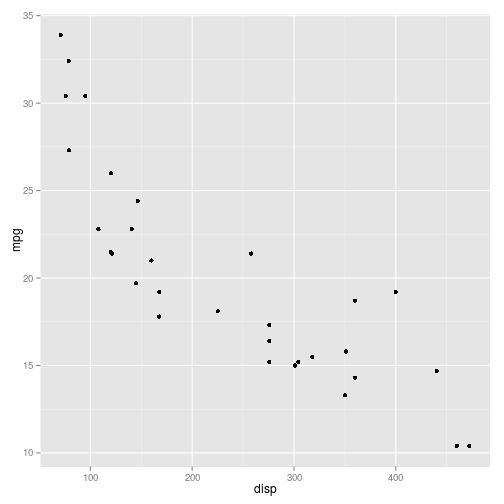
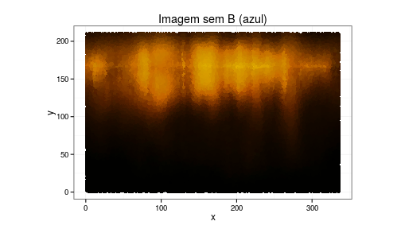
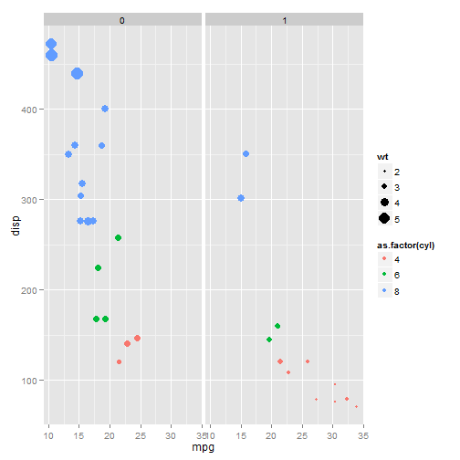
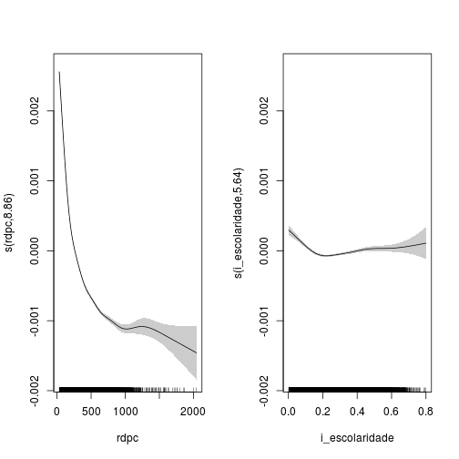
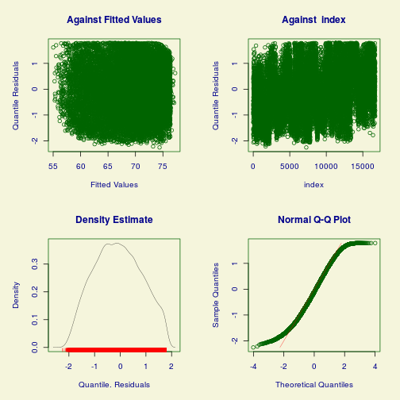
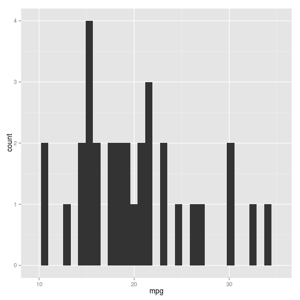
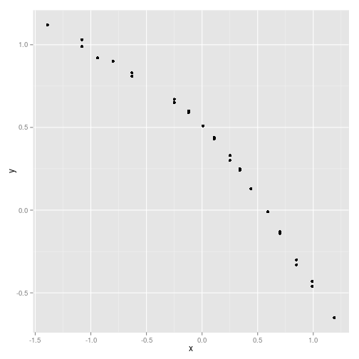
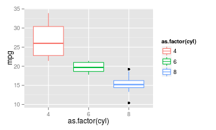
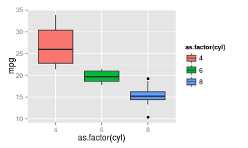
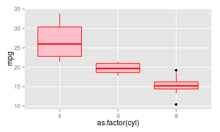

---
output:
  html_document:
    number_sections: no
    toc: yes
---

---
title: Aula 05 - Gráficos com estilo - ggplot2
date : 2015-01-28
---

# O pacote ggplot2

O `ggplot2` é um pacote do R voltado para a criação de gráficos estatísticos. Ele é baseado na Gramática dos Gráficos (*grammar of graphics*, em inglês), criado por Leland Wilkinson, que é uma resposta para a pergunta: o que é um gráfico estatístico? Resumidamente, a gramática diz que um gráfico estatístico é um mapeamento dos dados a partir de atributos estéticos (cores, formas, tamanho) de formas geométricas (pontos, linhas, barras).

Para mais informações sobre a Gramática dos Gráficos, você pode consultar o livro [*The Grammar of graphics*](http://www.springer.com/statistics/computational+statistics/book/978-0-387-24544-7), escrito pelo Leland Wilkinson, ou o livro [ggplot2: elegant graphics for data analysis](http://ggplot2.org/book/), do Hadley Wickham.

## Instalação

O `ggplot2` não faz parte dos pacotes base do R. Assim, antes de usá-lo, você precisa baixar e instalar o pacote. Para isso, é necessário ter pelo menos a versão 2.8 do R, pois o `ggplot2` não é compatível com versões anteriores.

Para baixar e instalar o pacote, utilize a seguitne linha de código:


```r
install.packages("ggplot2")
```
Não se esqueça de carregar o pacote antes de utilizá-lo:


```r
library(ggplot2)
```

# Construindo gráficos

A seguir, vamos discutir os aspcetos básicos para a construção de gráficos com o pacote `gglplot2`. Para isso, utilizaremos o banco de dados contido no objeto `mtcars`. Para visualizar as primeiras linhas deste banco, utilize o comando:


```r
head(mtcars)
```

```
##                    mpg cyl disp  hp drat    wt  qsec vs am gear carb
## Mazda RX4         21.0   6  160 110 3.90 2.620 16.46  0  1    4    4
## Mazda RX4 Wag     21.0   6  160 110 3.90 2.875 17.02  0  1    4    4
## Datsun 710        22.8   4  108  93 3.85 2.320 18.61  1  1    4    1
## Hornet 4 Drive    21.4   6  258 110 3.08 3.215 19.44  1  0    3    1
## Hornet Sportabout 18.7   8  360 175 3.15 3.440 17.02  0  0    3    2
## Valiant           18.1   6  225 105 2.76 3.460 20.22  1  0    3    1
```

## As camadas de um gráfico

No `ggplot2`, os gráficos são construídos camada por camada (ou, *layers*, em inglês), sendo que a primeira delas é dada pela função `ggplot` (não tem o "2"). Cada camada representa um tipo de mapeamento ou personalização do gráfico. O código abaixo é um exemplo de um gráfico bem simples, construído a partir das duas principais camadas. 


```r
ggplot(data = mtcars, aes(x = disp, y = mpg)) + 
  geom_point()
```

 

Observe que o primeiro argumento da função `ggplot` é um data frame. A função `aes()` descreve como as variáveis são mapeadas em aspectos visuais de formas geométricas definidas pelos *geoms*. Aqui, essas formas geométricas são pontos, selecionados pela função `geom_point()`, gerando, assim, um gráfico de dispersão. A combinação dessas duas camadas define o tipo de gráfico que você deseja construir.

### Aesthetics

A primeira camada de um gráfico deve indicar a relação entre os dados e cada aspecto visual do gráfico, como qual variável será representada no eixo x, qual será representada no eixo y, a cor e o tamanho dos componentes geométricos etc. Os aspectos que podem ou devem ser mapeados depende do tipo de gráfico que você deseja fazer.

No exemplo acima, atribuímos aspectos de posição: ao eixo y mapeamos a variável `mpg` (milhas por galão) e ao eixo x a variável `disp` (cilindradas). Outro aspecto que pode ser mapeado nesse gráfico é a cor dos pontos


```r
ggplot(data = mtcars, aes(x = disp, y = mpg, colour = as.factor(am))) + 
  geom_point()
```

 

Agora, a variável `am` (tipo de transmissão) foi mapeada à cor dos pontos, sendo que pontos vermelhos correspondem à transmissão automática (valor 0) e pontos azuis à transmissão manual (valor 1). Observe que inserimos a variável `am` como um fator, pois temos interesse apenas nos valores "0" e "1". No entanto, tambem podemos mapear uma variável contínua à cor dos pontos:


```r
ggplot(mtcars, aes(x = disp, y = mpg, colour = cyl)) + 
  geom_point()
```

 

Aqui, o número de cilindros, `cyl`, é representado pela tonalidade da cor azul.

**Nota**: por *default*, a legenda é insirida no gráfico automaticamente.

Também podemos mapear o tamanho dos pontos à uma variável de interesse:


```r
ggplot(mtcars, aes(x = disp, y = mpg, colour = cyl, size = wt)) +
  geom_point()
```

 

**Exercício**: pesquisar mais aspectos que podem ser alterados no gráfico de dispersão.

### Geoms

Os *geoms* definem qual forma geométrica será utilizada para a visualização dos dados no gráfico. Como já vimos, a função `geom_point()` gera gráficos de dispersão transformando pares (x,y) em pontos. Veja a seguir outros *geoms* bastante utilizados:

- geom_line: para retas por pares (x,y)
- geom_abline: para retas definidas por um intercepto e uma inclinação
- geom_hline: para retas horizontais
- geom_boxplot: para boxplots
- geom_histogram: para histogramas
- geom_density: para densidades
- geom_area: para áreas

Veja a seguir como é fácil gerar diversos gráficos diferentes utilizando a mesma estrutura do gráfico de dispersão acima:


```r
ggplot(mtcars, aes(x = as.factor(cyl), y = mpg)) + 
  geom_boxplot()
```

 


```r
ggplot(mtcars, aes(x = mpg)) + 
  geom_histogram()
```

```
## stat_bin: binwidth defaulted to range/30. Use 'binwidth = x' to adjust this.
```

 

Para fazer um boxplot para cada grupo, precisamos passar para o aspecto x do gráfico uma variável do tipo fator. 

Da mesma forma podemos deixar o boxplot colorido usando:


```r
ggplot(mtcars, aes(x = as.factor(cyl), y = mpg, colour = as.factor(cyl))) + geom_boxplot()
```

 

Os aspecto colour do boxplot, muda a cor do contorno. Para mudar o preenchimento, basta trocar o argumento `colour` pelo argumento `fill`.


```r
ggplot(mtcars, aes(x = as.factor(cyl), y = mpg, fill = as.factor(cyl))) + geom_boxplot()
```

 

Sempre que usamos algum argumento de cor, o ggplot automaticamente inclui uma legenda no gráfico. Mas no caso do boxplot a legenda não faz muito sentido. Para omitir usamos o comando `+ scale_fill_discrete(guide = F)`.

O nome da função é composto de três partes: 
* scale: queremos fazer alguma personalização na escala
* fill: a alteração será na escala de preenchimento
* discrete: a escala de cores é discreta


```r
ggplot(mtcars, aes(x = as.factor(cyl), y = mpg, fill = as.factor(cyl))) + geom_boxplot() + scale_fill_discrete(guide = F)
```

 

### Facets

Outra funcionalidade muito importante do ggplot é o uso de facets (?) Já temos bastante informação no gráfico acima, mas se quiséssemos ver as diferenças entre os carros automaticos e manuais (variável am) poderiamos usar ainda o aspecto de formato do ponto. Também podemos usar o facet:


```r
ggplot(mtcars, aes(x = mpg, y = disp, colour = as.factor(cyl), size = wt)) + geom_point() + facet_grid(.~am)
```

 

Podemos empilhar os dois gráficos também:


```r
ggplot(mtcars, aes(x = mpg, y = disp, colour = as.factor(cyl), size = wt)) + geom_point() + facet_grid(am~.)
```

 


# Tipos de gráficos

# Personalizando o seu gráfico: 'theme()' 
