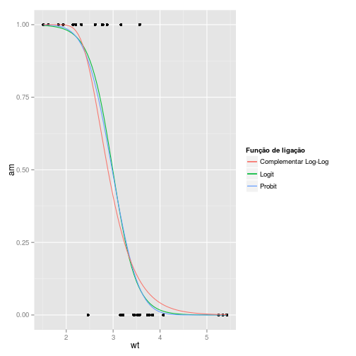
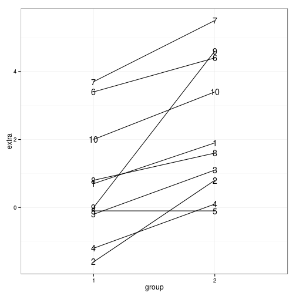
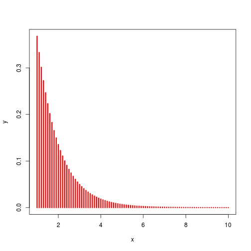
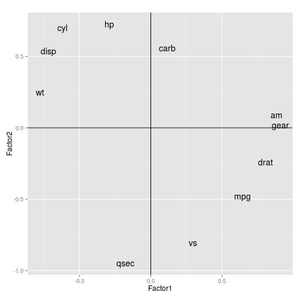

<a href="http://curso-r.github.io/slides/aula_07_apresentacao.html" target="_blank">Slides dessa aula</a>

<a href="http://curso-r.github.io/script/aula_07.R" target="_blank">Script dessa aula</a>


# Regressão Linear e ANOVA

O R tem todo o ferramentário necessário para fazer modelos lineares, a começar pelo modelo de regressão linear normal.

Para ilustrar, vamos utilizar a base de dados `mtcars` que vem no R.

Cada uma das 32 linhas da base `mtcars` representa um carro. A variável `mpg` é o consumo de combustível em milhas por galão (~3.76 Litros) e iremos tentar explicá-la pelas demais características dos veículos. 

## Um pouco de descritiva

### Univariada


```r
# os dados
head(mtcars)
```

```
##                    mpg cyl disp  hp drat    wt  qsec vs am gear carb
## Mazda RX4         21.0   6  160 110 3.90 2.620 16.46  0  1    4    4
## Mazda RX4 Wag     21.0   6  160 110 3.90 2.875 17.02  0  1    4    4
## Datsun 710        22.8   4  108  93 3.85 2.320 18.61  1  1    4    1
## Hornet 4 Drive    21.4   6  258 110 3.08 3.215 19.44  1  0    3    1
## Hornet Sportabout 18.7   8  360 175 3.15 3.440 17.02  0  0    3    2
## Valiant           18.1   6  225 105 2.76 3.460 20.22  1  0    3    1
```

```r
# banco de dados das variáveis contínuas no formato "longo"
mtcars_long <- mtcars %>%  
  select(mpg, disp:qsec) %>%
  gather(var_continuas) 
```

```
## Error in select(., mpg, disp:qsec): unused arguments (mpg, disp:qsec)
```

```r
# medidas resumo para variáveis contínuas
mtcars_long %>%
  group_by(var_continuas) %>%
  summarise("N" = n(),
            "Missing" = sum(is.na(value)),
            "Media" = mean(value),
            "DesvPad" = sd(value),
            "Minimo" = min(value),
            "Q1" = quantile(value, 0.25),
            "Mediana" = quantile(value, 0.50),
            "Q3" = quantile(value, 0.75),
            "Maximo" = max(value)) %>%
  mutate_each(funs(round(.,1)), -var_continuas)
```

```
## Error in eval(expr, envir, enclos): object 'mtcars_long' not found
```

```r
# boxplots
mtcars_long %>%
  ggplot() +
  geom_boxplot(aes(x=1, y = value)) +
  facet_wrap(~var_continuas, scales = "free") 
```

```
## Error in eval(expr, envir, enclos): object 'mtcars_long' not found
```

```r
# frequencias de variáveis categóricas
mtcars_freq <- mtcars %>%
  select(cyl, vs:carb) %>%
  gather(vars_categoricas) %>%
  rename(categoria = value) %>%
  group_by(vars_categoricas, categoria) %>%
  summarise(freq = n()) %>%
  group_by(vars_categoricas) %>%
  mutate(prop = freq/sum(freq),
         prop_txt = (prop*100) %>% round(0) %>% paste0("%"))
```

```
## Error in select(., cyl, vs:carb): unused arguments (cyl, vs:carb)
```

```r
mtcars_freq
```

```
## Error in eval(expr, envir, enclos): object 'mtcars_freq' not found
```

```r
# Gráfico de barras
mtcars_freq %>%
  ggplot() +
  geom_bar(aes(x=categoria, y = freq), position = "dodge", stat = "identity") +
  facet_wrap(~vars_categoricas, scales="free")  
```

```
## Error in eval(expr, envir, enclos): object 'mtcars_freq' not found
```

### Versus `mpg`


```r
# Matriz de correlação linear
mtcars %>%  
  select(mpg, disp:qsec) %>%
  cor %>%
  round(2) 
```

```
## Error in select(., mpg, disp:qsec): unused arguments (mpg, disp:qsec)
```

```r
# Matriz de dispersão
pairs(mtcars %>%  
  select(mpg, disp:qsec))
```

```
## Error in select(., mpg, disp:qsec): unused arguments (mpg, disp:qsec)
```


## Regressão linear
A função que ajusta modelo linear normal no R é `lm()`. Você especifica o banco de dados e a fórmula com as variáveis que você deseja associar.


```r
ajuste <- lm(resposta ~ explicativas, data = meus_dados)
```

O objeto `ajuste` contém todos os resultados e com a ajuda de alguns comandos, você extrai tudo o que é interessante.

Exemplo:

```r
ajuste_lm <- lm(mpg ~ wt, data = mtcars)

ajuste_lm
```

```
## 
## Call:
## lm(formula = mpg ~ wt, data = mtcars)
## 
## Coefficients:
## (Intercept)           wt  
##      37.285       -5.344
```

No código acima temos `mpg` explicado por `wt`. A saída do `lm()` mostra qual foi a chamada do modelo e os coeficientes ajustados. Como visto na análise descritiva, há uma clara associação linear e negativa entre as variáveis, justificando o parâmetro negativo `wt = -5.344`. A função `coeficients()` ou `coef()` nos fornece os coeficientes ajustados.

Gráfico da reta ajustada:

```r
# extrai os coeficientes ajustados
coeficientes <- coef(ajuste_lm)

ggplot(mtcars) +
  geom_point(aes(x = wt, y = mpg)) +
  geom_abline(intercept = coeficientes[1], slope = coeficientes[2])
```

 

**summary()**

A função `summary()` é uma função genérica que geralmente devolve um resumo de informações úteis de praticamente qualquer classe de objetos. Para objetos `lm()` ela devolve:

1. Chamada do modelo
2. Medidas resumo dos resíduos
3. Tabela de coeficientes, desvios padrão e testes T para hipótese nula de parâmetros iguais a zero.
4. Média dos quadrados do resíduo e os respectivos graus de liberdade; $R^2$ e $R^2$ ajustado da regressão; Estatística F para qualidade do ajuste (comparação com o modelo com apenas o intercepto).


```r
summary(ajuste_lm)
```


**plot()**

A função `plot()` constrói gráficos úteis para diagnóstico do modelo.


```r
# opção para mostrar 4 gráficos em uma mesma figura
par(mfrow = c(2,2))

# gráficos de diagnóstico do modelo ajuste_lm
plot(ajuste_lm)
```

 

```r
# retorna ao normal
par(mfrow = c(1,1))
```

**anova()**

Uma parte importante da modelagem é a redução de modelos. A função `anova()` compara dois (ou mais) modelos encaixados por meio da estatística F (por padrão), especialmente indicadas para modelos lineares normais. Caso seja passada apenas um ajuste à função, ela devolve a tabela de ANOVA (termos testados sequencialmente).


```r
# modelo nulo, com apenas o intercepto
ajuste_lm_nulo <- lm(mpg ~ 1, data = mtcars)

# modelo com wt e cyl
ajuste_lm2 <- lm(mpg ~ wt + factor(cyl), data = mtcars)

# compara o modelo com wt com o modelo nulo
anova(ajuste_lm_nulo, ajuste_lm)
```

```
## Analysis of Variance Table
## 
## Model 1: mpg ~ 1
## Model 2: mpg ~ wt
##   Res.Df     RSS Df Sum of Sq      F    Pr(>F)    
## 1     31 1126.05                                  
## 2     30  278.32  1    847.73 91.375 1.294e-10 ***
## ---
## Signif. codes:  0 '***' 0.001 '**' 0.01 '*' 0.05 '.' 0.1 ' ' 1
```

```r
# Tabela de ANOVA, testa os termos sequencialmente
anova(ajuste_lm2)
```

```
## Analysis of Variance Table
## 
## Response: mpg
##             Df Sum Sq Mean Sq  F value    Pr(>F)    
## wt           1 847.73  847.73 129.6650 5.079e-12 ***
## factor(cyl)  2  95.26   47.63   7.2856  0.002835 ** 
## Residuals   28 183.06    6.54                       
## ---
## Signif. codes:  0 '***' 0.001 '**' 0.01 '*' 0.05 '.' 0.1 ' ' 1
```

A o valor-p = 0.001064 indica que o modelo com `wt + cyl` trás melhorias significantes no poder explicativo do modelo quando comparado ao modelo com apenas `wt`. 

**demais comandos**

Outros comandos úteis são:


|      Função       |                   Descrição                    |
|:-----------------:|:----------------------------------------------:|
|     confint()     |   Intervalo de confiança para os parâmetros    |
|      resid()      |               Resíduos do modelo               |
|     fitted()      |               Valores ajustados                |
|       AIC()       |        Critério de informação de Akaike        |
|  model.matrix()   |  Matriz de planejamento (matriz X) do modelo   |
| linearHypotesis() |  Teste de combinações lineares de parâmetros   |
|      vcov()       | Matriz de variância-covariância dos parâmetros |

## Fórmulas

Objetos de classe `formula` possuem sintaxe muito conveniente para especificar o modelo estatístico que desejamos ajustar. O símbolo que define esses objetos é o `~`.

Estrutura:

```r
ajuste <- lm(resposta ~ explicativas)
```

Então se o objetivo fosse ajustar o modelo

$$
Y_i = \beta_0 + \beta_1X_i + \epsilon_i,
$$

passaríamos ao R a seguinte fórmula


```r
ajuste <- lm(Y ~ X)
```

Para incorporar mais variáveis usamos o símbolo `+`. O modelo

$$
Y_i = \beta_0 + \beta_1X_i + \beta_2Z_i + \epsilon_i,
$$

ficaria traduzido como


```r
ajuste <- lm(Y ~ X + Z)
```

Utilizamos o símbolo `*` para introduzir os componentes de interação, além dos componentes aditivos.


```r
ajuste <- lm(Y ~ X * Z)
```

Teoricamente teríamos, para Z **contínua**, o modelo de regressão

$$
Y_i = \beta_0 + \beta_1X_i + \beta_2Z_i + \beta_3X_i*Z_i + \epsilon_i,
$$

Ou, para Z **categórica**, o modelo de ANCOVA

$$
Y_{ij} = \alpha_j + \beta_jX_{ij} + \epsilon_{ij},
$$

O operador `:` faz com que apenas o componente de interação seja incluído no modelo. Para ilustrar, observe que o modelo


```r
ajuste <- lm(Y ~ X * Z)
```

é a mesma coisa que


```r
ajuste <- lm(Y ~ X + Z + X:Z)
```

Os operadores aritméticos exercem função diferente em fórmulas. O sinal de `+` no exemplo induziu em um modelo aditivo em vez de somar X com Z. Para fazer com que eles assumam seus significados aritméticos temos que utilizar a função `I()`. Exemplo:


```r
ajuste <- lm(Y ~ I(X + Z))
```

Agora sim o componente `I(X + Z)` representa a soma de X com Z. Outros exemplos: `I(X^2)`, `I(log(X + 1))`, `I(sqrt(X+Z*5))`.

**Tabela de simbolos para utilizar em fórmulas**


|    Símbolo    |
|:-------------:|
|      + X      |
|      - X      |
|     X * Z     |
|     X : Z     |
| (X + Z + W)^2 |
|   I(X + Z)    |
|     X - 1     |
|       .       |

Table: Table continues below

 

|                               Descrição                                |
|:----------------------------------------------------------------------:|
|                          inclui a variável X                           |
|                          retira a variável X                           |
|                  inclui X, Z e a interação entre elas                  |
|          inclui apenas o componente de interação entre X e Z           |
|                  inclui X, Z, W e as interações 2 a 2                  |
| Função identidade. Inclui uma variável construída pela soma de X com Z |
|          Remove o intercepto (regressão passando pela origem)          |
|             O ponto representa 'todas as demais variáveis'             |

## Seleção de variáveis

### linearHypothesis

Frequentemente temos interesse em saber se parâmetros são diferentes de zero ou se são diferentes entre si. Para isto, costumamos efetuar testes do tipo Wald para combinações lineares dos parâmetros.

Para este fim, a função `linearHypothesis()` do pacote `car` faz o trabalho.


```r
library(car)

linearHypothesis(ajuste_lm, c(0,1))
```

```
## Linear hypothesis test
## 
## Hypothesis:
## wt = 0
## 
## Model 1: restricted model
## Model 2: mpg ~ wt
## 
##   Res.Df     RSS Df Sum of Sq      F    Pr(>F)    
## 1     31 1126.05                                  
## 2     30  278.32  1    847.73 91.375 1.294e-10 ***
## ---
## Signif. codes:  0 '***' 0.001 '**' 0.01 '*' 0.05 '.' 0.1 ' ' 1
```

### stepwise

Stepwise no R se faz com as funções `step()` do pacote `stats` ou `stepAIC()` do pacote `MASS`. Escolher entre `forward`, `backward` ou `both` (ambos) basta passar um desses nomes ao parâmetro `direction` da função.


```r
# modelo aditivo completo
ajuste_lm_completo <- lm(mpg ~ ., data = mtcars)

# modelo forward
step(ajuste_lm_completo, direction = "forward")
```

```
## Start:  AIC=70.9
## mpg ~ cyl + disp + hp + drat + wt + qsec + vs + am + gear + carb
```

```
## 
## Call:
## lm(formula = mpg ~ cyl + disp + hp + drat + wt + qsec + vs + 
##     am + gear + carb, data = mtcars)
## 
## Coefficients:
## (Intercept)          cyl         disp           hp         drat           wt         qsec           vs           am         gear  
##    12.30337     -0.11144      0.01334     -0.02148      0.78711     -3.71530      0.82104      0.31776      2.52023      0.65541  
##        carb  
##    -0.19942
```

```r
# modelo backward
step(ajuste_lm_completo, direction = "backward")
```

```
## Start:  AIC=70.9
## mpg ~ cyl + disp + hp + drat + wt + qsec + vs + am + gear + carb
## 
##        Df Sum of Sq    RSS    AIC
## - cyl   1    0.0799 147.57 68.915
## - vs    1    0.1601 147.66 68.932
## - carb  1    0.4067 147.90 68.986
## - gear  1    1.3531 148.85 69.190
## - drat  1    1.6270 149.12 69.249
## - disp  1    3.9167 151.41 69.736
## - hp    1    6.8399 154.33 70.348
## - qsec  1    8.8641 156.36 70.765
## <none>              147.49 70.898
## - am    1   10.5467 158.04 71.108
## - wt    1   27.0144 174.51 74.280
## 
## Step:  AIC=68.92
## mpg ~ disp + hp + drat + wt + qsec + vs + am + gear + carb
## 
##        Df Sum of Sq    RSS    AIC
## - vs    1    0.2685 147.84 66.973
## - carb  1    0.5201 148.09 67.028
## - gear  1    1.8211 149.40 67.308
## - drat  1    1.9826 149.56 67.342
## - disp  1    3.9009 151.47 67.750
## - hp    1    7.3632 154.94 68.473
## <none>              147.57 68.915
## - qsec  1   10.0933 157.67 69.032
## - am    1   11.8359 159.41 69.384
## - wt    1   27.0280 174.60 72.297
## 
## Step:  AIC=66.97
## mpg ~ disp + hp + drat + wt + qsec + am + gear + carb
## 
##        Df Sum of Sq    RSS    AIC
## - carb  1    0.6855 148.53 65.121
## - gear  1    2.1437 149.99 65.434
## - drat  1    2.2139 150.06 65.449
## - disp  1    3.6467 151.49 65.753
## - hp    1    7.1060 154.95 66.475
## <none>              147.84 66.973
## - am    1   11.5694 159.41 67.384
## - qsec  1   15.6830 163.53 68.200
## - wt    1   27.3799 175.22 70.410
## 
## Step:  AIC=65.12
## mpg ~ disp + hp + drat + wt + qsec + am + gear
## 
##        Df Sum of Sq    RSS    AIC
## - gear  1     1.565 150.09 63.457
## - drat  1     1.932 150.46 63.535
## <none>              148.53 65.121
## - disp  1    10.110 158.64 65.229
## - am    1    12.323 160.85 65.672
## - hp    1    14.826 163.35 66.166
## - qsec  1    26.408 174.94 68.358
## - wt    1    69.127 217.66 75.350
## 
## Step:  AIC=63.46
## mpg ~ disp + hp + drat + wt + qsec + am
## 
##        Df Sum of Sq    RSS    AIC
## - drat  1     3.345 153.44 62.162
## - disp  1     8.545 158.64 63.229
## <none>              150.09 63.457
## - hp    1    13.285 163.38 64.171
## - am    1    20.036 170.13 65.466
## - qsec  1    25.574 175.67 66.491
## - wt    1    67.572 217.66 73.351
## 
## Step:  AIC=62.16
## mpg ~ disp + hp + wt + qsec + am
## 
##        Df Sum of Sq    RSS    AIC
## - disp  1     6.629 160.07 61.515
## <none>              153.44 62.162
## - hp    1    12.572 166.01 62.682
## - qsec  1    26.470 179.91 65.255
## - am    1    32.198 185.63 66.258
## - wt    1    69.043 222.48 72.051
## 
## Step:  AIC=61.52
## mpg ~ hp + wt + qsec + am
## 
##        Df Sum of Sq    RSS    AIC
## - hp    1     9.219 169.29 61.307
## <none>              160.07 61.515
## - qsec  1    20.225 180.29 63.323
## - am    1    25.993 186.06 64.331
## - wt    1    78.494 238.56 72.284
## 
## Step:  AIC=61.31
## mpg ~ wt + qsec + am
## 
##        Df Sum of Sq    RSS    AIC
## <none>              169.29 61.307
## - am    1    26.178 195.46 63.908
## - qsec  1   109.034 278.32 75.217
## - wt    1   183.347 352.63 82.790
```

```
## 
## Call:
## lm(formula = mpg ~ wt + qsec + am, data = mtcars)
## 
## Coefficients:
## (Intercept)           wt         qsec           am  
##       9.618       -3.917        1.226        2.936
```

```r
# modelo both
step(ajuste_lm_completo, direction = "both")
```

```
## Start:  AIC=70.9
## mpg ~ cyl + disp + hp + drat + wt + qsec + vs + am + gear + carb
## 
##        Df Sum of Sq    RSS    AIC
## - cyl   1    0.0799 147.57 68.915
## - vs    1    0.1601 147.66 68.932
## - carb  1    0.4067 147.90 68.986
## - gear  1    1.3531 148.85 69.190
## - drat  1    1.6270 149.12 69.249
## - disp  1    3.9167 151.41 69.736
## - hp    1    6.8399 154.33 70.348
## - qsec  1    8.8641 156.36 70.765
## <none>              147.49 70.898
## - am    1   10.5467 158.04 71.108
## - wt    1   27.0144 174.51 74.280
## 
## Step:  AIC=68.92
## mpg ~ disp + hp + drat + wt + qsec + vs + am + gear + carb
## 
##        Df Sum of Sq    RSS    AIC
## - vs    1    0.2685 147.84 66.973
## - carb  1    0.5201 148.09 67.028
## - gear  1    1.8211 149.40 67.308
## - drat  1    1.9826 149.56 67.342
## - disp  1    3.9009 151.47 67.750
## - hp    1    7.3632 154.94 68.473
## <none>              147.57 68.915
## - qsec  1   10.0933 157.67 69.032
## - am    1   11.8359 159.41 69.384
## + cyl   1    0.0799 147.49 70.898
## - wt    1   27.0280 174.60 72.297
## 
## Step:  AIC=66.97
## mpg ~ disp + hp + drat + wt + qsec + am + gear + carb
## 
##        Df Sum of Sq    RSS    AIC
## - carb  1    0.6855 148.53 65.121
## - gear  1    2.1437 149.99 65.434
## - drat  1    2.2139 150.06 65.449
## - disp  1    3.6467 151.49 65.753
## - hp    1    7.1060 154.95 66.475
## <none>              147.84 66.973
## - am    1   11.5694 159.41 67.384
## - qsec  1   15.6830 163.53 68.200
## + vs    1    0.2685 147.57 68.915
## + cyl   1    0.1883 147.66 68.932
## - wt    1   27.3799 175.22 70.410
## 
## Step:  AIC=65.12
## mpg ~ disp + hp + drat + wt + qsec + am + gear
## 
##        Df Sum of Sq    RSS    AIC
## - gear  1     1.565 150.09 63.457
## - drat  1     1.932 150.46 63.535
## <none>              148.53 65.121
## - disp  1    10.110 158.64 65.229
## - am    1    12.323 160.85 65.672
## - hp    1    14.826 163.35 66.166
## + carb  1     0.685 147.84 66.973
## + vs    1     0.434 148.09 67.028
## + cyl   1     0.414 148.11 67.032
## - qsec  1    26.408 174.94 68.358
## - wt    1    69.127 217.66 75.350
## 
## Step:  AIC=63.46
## mpg ~ disp + hp + drat + wt + qsec + am
## 
##        Df Sum of Sq    RSS    AIC
## - drat  1     3.345 153.44 62.162
## - disp  1     8.545 158.64 63.229
## <none>              150.09 63.457
## - hp    1    13.285 163.38 64.171
## + gear  1     1.565 148.53 65.121
## + cyl   1     1.003 149.09 65.242
## + vs    1     0.645 149.45 65.319
## + carb  1     0.107 149.99 65.434
## - am    1    20.036 170.13 65.466
## - qsec  1    25.574 175.67 66.491
## - wt    1    67.572 217.66 73.351
## 
## Step:  AIC=62.16
## mpg ~ disp + hp + wt + qsec + am
## 
##        Df Sum of Sq    RSS    AIC
## - disp  1     6.629 160.07 61.515
## <none>              153.44 62.162
## - hp    1    12.572 166.01 62.682
## + drat  1     3.345 150.09 63.457
## + gear  1     2.977 150.46 63.535
## + cyl   1     2.447 150.99 63.648
## + vs    1     1.121 152.32 63.927
## + carb  1     0.011 153.43 64.160
## - qsec  1    26.470 179.91 65.255
## - am    1    32.198 185.63 66.258
## - wt    1    69.043 222.48 72.051
## 
## Step:  AIC=61.52
## mpg ~ hp + wt + qsec + am
## 
##        Df Sum of Sq    RSS    AIC
## - hp    1     9.219 169.29 61.307
## <none>              160.07 61.515
## + disp  1     6.629 153.44 62.162
## + carb  1     3.227 156.84 62.864
## + drat  1     1.428 158.64 63.229
## - qsec  1    20.225 180.29 63.323
## + cyl   1     0.249 159.82 63.465
## + vs    1     0.249 159.82 63.466
## + gear  1     0.171 159.90 63.481
## - am    1    25.993 186.06 64.331
## - wt    1    78.494 238.56 72.284
## 
## Step:  AIC=61.31
## mpg ~ wt + qsec + am
## 
##        Df Sum of Sq    RSS    AIC
## <none>              169.29 61.307
## + hp    1     9.219 160.07 61.515
## + carb  1     8.036 161.25 61.751
## + disp  1     3.276 166.01 62.682
## + cyl   1     1.501 167.78 63.022
## + drat  1     1.400 167.89 63.042
## + gear  1     0.123 169.16 63.284
## + vs    1     0.000 169.29 63.307
## - am    1    26.178 195.46 63.908
## - qsec  1   109.034 278.32 75.217
## - wt    1   183.347 352.63 82.790
```

```
## 
## Call:
## lm(formula = mpg ~ wt + qsec + am, data = mtcars)
## 
## Coefficients:
## (Intercept)           wt         qsec           am  
##       9.618       -3.917        1.226        2.936
```


---
## Regressão Linear Generalizada

A regressão linear normal pode ser inadequada quando a distribuição de $Y_i$ é assimétrica, representa
dados de contagens ou então dados binários. Para lidar com esse problema, McCulagh e Nelder estenderam
a família de distribuições para ajuste da regressão para distribuições da _família exponencial_. Tal
família inclui as distribuições `normal`, `poisson`, `gama`, `normal inversa` e `binomial` (incluindo
`bernoulli`), entre outras. Também existe uma forma de adaptar os MLG para a distribuição `binomial negativa`.

A definição dos MLG é dada por

$$
Y_i \sim F(\mu_i, \phi)
$$

$$
\mu_i = g^{-1}(\alpha + \beta_1 x_{i1} + \beta_p x_{ip})
$$

O parâmetro $\phi$ é o parâmetro de precisão (inverso do parâmetro de dispersão) e $g$ é a _função de ligação_, que geralmente tem o papel de jogar o intervalo de vação de $\mu_i$ (espaço paramétrico) no intervalo $(-\inf, \inf)$.

Para ajustar um modelo linear generalizado, basta utilizar a função `glm` e informar, além da fórmula, a família de distribuições da resposta.

### Famílias de distribuições


|      Family      |          Link          |
|:----------------:|:----------------------:|
|     gaussian     |        identity        |
|     binomial     | logit, probit, cloglog |
|     poisson      |  log, identity, sqrt   |
|      Gamma       | inverse, identity, log |
| inverse.gaussian |         1/mu^2         |
|      quasi       | definido pelo usuário  |

### Ajuste do modelo


```r
ajuste_glm <- glm(resposta ~ explicativas, data = dados, family = distribuicao)
```

Para ver a lista de distribuições que podem ser passadas ao parâmetro `family`, rode `?family` no R.

Outro componente importante em modelos lineares generalizados é a função de ligação. De modo mais geral, o código para ajsutar um MLG fica assim:


```r
ajuste_glm <- glm(resposta ~ explicativas, data = dados, family = distribuicao(link = funcao_de_ligacao))
```

Repare que agora existe a parte `(link = funcao_de_ligacao)` depois do nome da distribuição escolhida. É comum trocar a ligação `inversa` de uma regressão Gama para uma ligação `log`, por exemplo. Em R, ficaria:


```r
ajuste_gama <- glm(Y ~ X + I(X^2) + Z, data = dados, family = Gamma(link = "log"))
```

Todas as funções úteis para `lm()` continuam sendo úteis para `glm()`.

### Exemplo: Regressão logística

A regressão logística se caracteriza por assumir distribuição binomial à variável resposta. Para exemplificar um ajuste de regressão logística, vamos aproveitar o mesmo banco `mtcars`, mas agora vamos modelar `am` em vez de `mpg`.

#### Breve descritiva


```r
mtcars %>%
  group_by(am) %>%
  summarise("N" = n(),
            "Missing" = sum(is.na(wt)),
            "Media" = mean(wt),
            "DesvPad" = sd(wt),
            "Minimo" = min(wt),
            "Q1" = quantile(wt, 0.25),
            "Mediana" = quantile(wt, 0.50),
            "Q3" = quantile(wt, 0.75),
            "Maximo" = max(wt)) %>%
  mutate_each(funs(round(.,1)), -am)
```

```
## Source: local data frame [2 x 10]
## 
##   am  N Missing Media DesvPad Minimo  Q1 Mediana  Q3 Maximo
## 1  0 19       0   3.8     0.8    2.5 3.4     3.5 3.8    5.4
## 2  1 13       0   2.4     0.6    1.5 1.9     2.3 2.8    3.6
```

```r
ggplot(mtcars) +
  geom_boxplot(aes(x = factor(am), y = wt))
```

 

#### Ajuste


```r
# Ligação logit
ajuste_glm <- glm(am ~ wt, data = mtcars, family = binomial)
summary(ajuste_glm)
```

```
## 
## Call:
## glm(formula = am ~ wt, family = binomial, data = mtcars)
## 
## Deviance Residuals: 
##      Min        1Q    Median        3Q       Max  
## -2.11400  -0.53738  -0.08811   0.26055   2.19931  
## 
## Coefficients:
##             Estimate Std. Error z value Pr(>|z|)   
## (Intercept)   12.040      4.510   2.670  0.00759 **
## wt            -4.024      1.436  -2.801  0.00509 **
## ---
## Signif. codes:  0 '***' 0.001 '**' 0.01 '*' 0.05 '.' 0.1 ' ' 1
## 
## (Dispersion parameter for binomial family taken to be 1)
## 
##     Null deviance: 43.230  on 31  degrees of freedom
## Residual deviance: 19.176  on 30  degrees of freedom
## AIC: 23.176
## 
## Number of Fisher Scoring iterations: 6
```

```r
table(mtcars$am, predict(ajuste_glm) > 0.5)
```

```
##    
##     FALSE TRUE
##   0    18    1
##   1     3   10
```

Por padrão, a função de ligação da distribuição `binomial` é a `logit`. Se quisermos usar a função `probit`, precisamos especificar isto no parâmetro `family`.


```r
# Ligaçao probit
ajuste_glm_probit <- glm(am ~ wt, data = mtcars, family = binomial(link = "probit"))
summary(ajuste_glm_probit)
```

```
## 
## Call:
## glm(formula = am ~ wt, family = binomial(link = "probit"), data = mtcars)
## 
## Deviance Residuals: 
##      Min        1Q    Median        3Q       Max  
## -2.04796  -0.55217  -0.05909   0.25290   2.18880  
## 
## Coefficients:
##             Estimate Std. Error z value Pr(>|z|)   
## (Intercept)   6.7264     2.2684   2.965  0.00302 **
## wt           -2.2578     0.7197  -3.137  0.00171 **
## ---
## Signif. codes:  0 '***' 0.001 '**' 0.01 '*' 0.05 '.' 0.1 ' ' 1
## 
## (Dispersion parameter for binomial family taken to be 1)
## 
##     Null deviance: 43.230  on 31  degrees of freedom
## Residual deviance: 19.199  on 30  degrees of freedom
## AIC: 23.199
## 
## Number of Fisher Scoring iterations: 7
```

Gráfico das curvas ajustadas:

```r
ggplot(mtcars, aes(x=wt, y=am)) + 
  geom_point() + 
  stat_smooth(aes(colour = "Logit"), method="glm", family=binomial, se=FALSE) +
  stat_smooth(aes(colour = "Probit"), method="glm", family=binomial(link = "probit"), se=FALSE) +
  stat_smooth(aes(colour = "Complementar Log-Log"), method="glm", family=binomial(link = "cloglog"), se=FALSE) +
  labs(colour = "Função de ligação")
```

 

O teste Chi quadrado pode ser mais indicado para regressão logística.


```r
anova(ajuste_glm, test="Chisq")
```

```
## Analysis of Deviance Table
## 
## Model: binomial, link: logit
## 
## Response: am
## 
## Terms added sequentially (first to last)
## 
## 
##      Df Deviance Resid. Df Resid. Dev  Pr(>Chi)    
## NULL                    31     43.230              
## wt    1   24.054        30     19.176 9.369e-07 ***
## ---
## Signif. codes:  0 '***' 0.001 '**' 0.01 '*' 0.05 '.' 0.1 ' ' 1
```

### Análise de diagnóstico

Na página [do professor Gilberto](http://www.ime.usp.br/~giapaula/textoregressao.htm) pode-se obter o livro dele sobre GLM e também vários comandos para realizar análises de diagnóstico dos modelos ajustados.

## Modelos mistos

Quando uma mesma unidade observacional é medida várias vezes em diferentes contextos, temos em mãos um problema de medidas repetidas. Em particular, quando essas medidas são realizadas ao longo do tempo, temos um problema de dados longitudinais.

A dificuldade desses tipos de estudo está no fato de que, como o mesmo indivíduo é observado em vários momentos, nem sempre é razoável considerar essas medidas como independentes. Por exemplo, se estou acompanhando o crescimento da massa de ovelhas ao longo do tempo, esperamos que a ovelha mais "gordinha" tende a ser sempre a mais gordinha.

Para resolver isso, geralmente impomos uma _estrutura de correlação_ para observações de um mesmo indivíduo, e uma maneira de impor essa estrutura de correlação é realizar uma análise com efeitos mistos.

A grande diferença de um modelo de regressão comum e um modelo misto é que parte dos parâmetros são na verdade variáveis aleatórias. Não vamos entrar em detalhe na parte teórica, mas se quiser, dê uma lida no [livro do professor Singer](http://www.ime.usp.br/~jmsinger/Textos/Singer&Nobre&Rocha2012mar.pdf), que está em andamento.

Para ajustar modelos mistos geralmente utilizamos os pacotes `nlme` e `lme4`. O pacote `nlme` faz algumas coisas a mais na parte de modelos não lineares, mas o pacote `lme4` é muito melhor desenvolvido atualmente e recomendamos seu uso.

### Exemplo: Teste t pareado

Geralmente utilizamos o teste t pareado quando queremos comparar médias, mas os indivíduos foram medidos em diferentes situações ou momentos.

Vamos ilustrar com os seguintes dados. Na base de dados `sleep`, temos medido o efeito de duas diferentes drogas aplicadas a 10 indivíduos (as duas drogas foram aplicadas nos 10 indivíduos) no tempo de sono. Queremos verificar se as drogas tiveram efeitos distintos.


```r
sleep %>%
  mutate(group=paste0('droga_', group)) %>%
  spread(group, extra)
```

```
##    ID droga_1 droga_2
## 1   1     0.7     1.9
## 2   2    -1.6     0.8
## 3   3    -0.2     1.1
## 4   4    -1.2     0.1
## 5   5    -0.1    -0.1
## 6   6     3.4     4.4
## 7   7     3.7     5.5
## 8   8     0.8     1.6
## 9   9     0.0     4.6
## 10 10     2.0     3.4
```

```r
sleep %>%
  ggplot() +
  geom_line(aes(x=group, y=extra, group=ID)) +
  geom_text(aes(x=group, y=extra, label=ID)) +
  theme_bw()
```

 

Teste t pareado

```r
aux <- sleep %>%
  mutate(group=paste0('droga_', group)) %>%
  spread(group, extra)

t.test(aux$droga_1, aux$droga_2, paired=TRUE)
```

```
## 
## 	Paired t-test
## 
## data:  aux$droga_1 and aux$droga_2
## t = -4.0621, df = 9, p-value = 0.002833
## alternative hypothesis: true difference in means is not equal to 0
## 95 percent confidence interval:
##  -2.4598858 -0.7001142
## sample estimates:
## mean of the differences 
##                   -1.58
```

Paralelo do modelo misto


```r
library(lme4)
modelo <- lmer(extra ~ group + 1|ID, data=sleep)
```

```
## Error: number of observations (=20) <= number of random effects (=20) for term (group + 1 | ID); the random-effects parameters and the residual variance (or scale parameter) are probably unidentifiable
```

```r
summary(modelo)
```

```
## Error in summary(modelo): object 'modelo' not found
```

A parte `1|ID` indica que o indivíduo é ID e que estamos incluindo um efeito aleatório para ele.


# Árvore de Decisão

Outra tipo de modelo muito utilizado que também une simplicidade com eficiência é o de árvore de decisão. No R, seu ajuste é tão simples quanto ajustar um modelo de regressão e possui um conjunto de funções igualmente convenientes para extrair resultados.

Vamos apresentar como ajustar árvore de decisão usando o pacote `tree`, mas, como tudo no R, existem inúmeros pacotes e jeitos de ajustar uma árvore de decisão (ver este [link](http://statistical-research.com/a-brief-tour-of-the-trees-and-forests/?utm_source=rss&utm_medium=rss&utm_campaign=a-brief-tour-of-the-trees-and-forests) para uma lista interessante de alternativas).

## Ajuste


```r
library(tree)
ajuste_tree <- tree(factor(am) ~ wt, data = mtcars)
summary(ajuste_tree)
```

```
## 
## Classification tree:
## tree(formula = factor(am) ~ wt, data = mtcars)
## Number of terminal nodes:  5 
## Residual mean deviance:  0.4955 = 13.38 / 27 
## Misclassification error rate: 0.09375 = 3 / 32
```

```r
plot(ajuste_tree)
text(ajuste_tree, pretty = 0)
```

 

Tabelas de observado versus predito: comparação entre os modelos logístico e árvore.

```r
# Logistico
table(mtcars$am, predict(ajuste_glm) > 0.5)

# Árvore
table(mtcars$am, predict(ajuste_tree)[,"1"] > 0.5)
```

## Cross-validation

Árvores tendem a "super-ajustar" (*overfit*) o modelo. Para este problema, *cross-validation* é uma boa prática. Essa técnica consiste em reservar parte da base separada para depois ser usada como régua para o poder preditivo do modelo.

Para fazer isso é muito fácil com a função `cv.tree()`. Basta passar seu modelo ajustado para ela:


```r
set.seed(123)
cv_tree <- cv.tree(ajuste_tree)
plot(cv_tree)
```

 

O gráfico mostra qual tamanho da árvore que apresentou o menor erro de predição. No nosso caso foi tamanho `2`.

Para recuperar esse ajuste de tamanho `2`, chamamos a função `prune.tree()` da seguinte forma:


```r
# seleciona a árvoore com 2 nós
melhor_tree <- prune.tree(ajuste_tree, best = 2)
# Gráfico que representa a árvore `melhor_tree`
plot(melhor_tree)
text(melhor_tree, pretty = 0)
```

 

```r
# oservado versus predito
table(mtcars$am, predict(melhor_tree)[,"1"] > 0.5)
```

```
## Error in eval(expr, envir, enclos): object 'ajuste_tree' not found
```

O modelo `melhor_tree` coincidiu com o `ajuste_tree` (que tinha tamanho `5`) quanto ao seu desempenho em prever, porém é muito mais simples. De fato ele é mais simples do que qualquer modelo feito até aqui.

## Parâmetros de controle

Árvores de decisão são ajustadas sob alguns critérios que às vezes precisamos reconfigurar. Por exemplo, no `ajuste_tree` vimos que havia muito mais galhos do que o necessário. Isso se deveu a critérios de divisão/parada desregulado. 

No caso dos objetos `tree`, temos dois parâmetros importantes: `split` e `control`.

**split**

O parâmetro `split` define qual o critério para decidir se divide o "galho" ou não. Por padrão, a função utiliza o critério "deviance", que tem a mesma definição do MLG. Uma segunda opção seria **Gini**.

**control**

O parâmetro `control` recebe um objeto retornado pela função `tree.control()`.

Esta função permite você configurar:

- `nobs` Número de observações na base de treino. Isso será efetivo no `cv.tree()`, quando uma base de treino e outra de teste é utilizada para calcular o erro de predição por meio de *cross-validation*.
- `mincut` Número mínimo de observações a serem incluídas em cada nó.
- `minsize` O menor tamanho de nó permitido.
- `mindev` Fração mínima do deviance do nó raiz.

Como passar à função:

```r
controles <- tree.control(nobs = 32, mincut = 10)
ajuste_tree <- ajuste_tree <- tree(factor(am) ~ wt, data = mtcars, control = controles)
plot(ajuste_tree);text(ajuste_tree, pretty = 0)
```

 

# Análise multivariada

## Análise de Agrupamento

Análise de agrupamento geralmente é uma ótima maneira de realizar estudos preliminares em uma base de dados, e algumas vezes pode trazer resultados muito úteis.

Como o próprio nome diz, geralmente a análise de agrupamento serve para formar grupos de indivíduos a partir da comparação das suas medidas em relação à diversas variáveis. Não confunda aqui com árvores de decisão, pois nesse caso não há uma variável "resposta".

Existem dois tipos principais de análise de agrupamento: _hierárquico_ e _k-means_. 

### K-means
No modelo k-means, selecionamos previamente o número de grupos e o modelo calcula, com base em algum critério, qual a melhor forma de alocar os indivíduos nesses grupos. 

Para ajustar essa análise utilizaremos a função `kmeans` do pacote `stats`. Existem mais pacotes que fazem essa análise no R.


```r
kms <- kmeans(mtcars, centers=2)
kms
```

```
## K-means clustering with 2 clusters of sizes 18, 14
## 
## Cluster means:
##        mpg      cyl     disp        hp     drat       wt     qsec        vs        am     gear     carb
## 1 23.97222 4.777778 135.5389  98.05556 3.882222 2.609056 18.68611 0.7777778 0.6111111 4.000000 2.277778
## 2 15.10000 8.000000 353.1000 209.21429 3.229286 3.999214 16.77214 0.0000000 0.1428571 3.285714 3.500000
## 
## Clustering vector:
##           Mazda RX4       Mazda RX4 Wag          Datsun 710      Hornet 4 Drive   Hornet Sportabout             Valiant 
##                   1                   1                   1                   1                   2                   1 
##          Duster 360           Merc 240D            Merc 230            Merc 280           Merc 280C          Merc 450SE 
##                   2                   1                   1                   1                   1                   2 
##          Merc 450SL         Merc 450SLC  Cadillac Fleetwood Lincoln Continental   Chrysler Imperial            Fiat 128 
##                   2                   2                   2                   2                   2                   1 
##         Honda Civic      Toyota Corolla       Toyota Corona    Dodge Challenger         AMC Javelin          Camaro Z28 
##                   1                   1                   1                   2                   2                   2 
##    Pontiac Firebird           Fiat X1-9       Porsche 914-2        Lotus Europa      Ford Pantera L        Ferrari Dino 
##                   2                   1                   1                   1                   2                   1 
##       Maserati Bora          Volvo 142E 
##                   2                   1 
## 
## Within cluster sum of squares by cluster:
## [1] 58920.54 93643.90
##  (between_SS / total_SS =  75.5 %)
## 
## Available components:
## 
## [1] "cluster"      "centers"      "totss"        "withinss"     "tot.withinss" "betweenss"    "size"         "iter"        
## [9] "ifault"
```

### Hierárquico

No modelo hierárquico, contudo, não selecionamos previamente o número de grupos, e o resultado da análise é um gráfico chamado _dendrograma_, que cria uma ordem de agrupamento dos indivíduos, desde o nível mais fragmentado (número de grupos igual ao número de indivíduos) até um agrupamento único.

Para ajustar o modelo hierárquico, utilizaremos a função `hclust`, do pacote `stats`. Existem vários métodos para ordenação dos ordenamentos. Utilizaremos aqui o método `ward.D`.

Diferentemente do método K-means, os métodos hierárquicos partem de uma matriz de distâncias ou, mais genericamente, matriz de dissimilaridades. A matrix de distâncias é uma matriz `d` com `dim(d) = c(n, n)`, onde `n` é o número de indivíduos. Geralmente é uma matriz simétrica, e na diagonal vale zero. 


```r
d <- dist(mtcars) # calcula matriz de distâncias euclidianas.
str(d)
```

```
## Class 'dist'  atomic [1:496] 0.615 54.909 98.113 210.337 65.472 ...
##   ..- attr(*, "Size")= int 32
##   ..- attr(*, "Labels")= chr [1:32] "Mazda RX4" "Mazda RX4 Wag" "Datsun 710" "Hornet 4 Drive" ...
##   ..- attr(*, "Diag")= logi FALSE
##   ..- attr(*, "Upper")= logi FALSE
##   ..- attr(*, "method")= chr "euclidean"
##   ..- attr(*, "call")= language dist(x = mtcars)
```

```r
hc <- hclust(d, method='ward.D')
hc
```

```
## 
## Call:
## hclust(d = d, method = "ward.D")
## 
## Cluster method   : ward.D 
## Distance         : euclidean 
## Number of objects: 32
```

```r
plot(hc)
```

 

No método hierárquico, portanto, geralmente precisamos tomar 2 decisões para rodar a análise e construir o dendrograma: i) o método para obtenção da matriz de distâncias e o método para ordenação das aglomerações.

__OBS:__ Na análise de agrupamento, muitas vezes a escala das variáveis faz diferença, e variáveis que assumem valores muito altos podem ter uma influência maior do que outras no resultado da análise. Por isso, muitas vezes temos interesse em re-escalar as variáveis, geralmente subtraindo a média e dividindo pelo desvio padrão (normalização). Para isso, veja `?scale`.

## Análise Fatorial

Outra análise multivariada muito comum é a _análise fatorial_. Nesse tipo de estudo, geralmente estamos interessados em obter combinações de variáveis que estejam associadas a alguma variável latente não observável. Em palavras mais simples, estamos interessados em obter alguns _fatores_ que expliquem a variabilidade dos nossos dados, e depois interpretar esses fatores de alguma forma.

Para realizar análise fatorial, vamos utilizar a função `factanal` do pacote `stats`. Essa função realiza análise fatorial usando método de máxima verossimilhança. Podemos utilizar outros métodos, como decomposição espectral (autovalor e autovetor), geralmente utilizada em _análise de componentes principais_.


```r
fa <- factanal(mtcars, factors=3, rotation='none')
fa
```

```
## 
## Call:
## factanal(x = mtcars, factors = 3, rotation = "none")
## 
## Uniquenesses:
##   mpg   cyl  disp    hp  drat    wt  qsec    vs    am  gear  carb 
## 0.135 0.055 0.090 0.127 0.290 0.060 0.051 0.223 0.208 0.125 0.158 
## 
## Loadings:
##      Factor1 Factor2 Factor3
## mpg  -0.910   0.137  -0.136 
## cyl   0.962          -0.135 
## disp  0.937  -0.174         
## hp    0.875   0.292   0.147 
## drat -0.689   0.453   0.175 
## wt    0.858  -0.382   0.242 
## qsec -0.591  -0.754   0.177 
## vs   -0.809  -0.309   0.164 
## am   -0.522   0.719         
## gear -0.459   0.729   0.365 
## carb  0.594   0.517   0.471 
## 
##                Factor1 Factor2 Factor3
## SS loadings      6.448   2.465   0.565
## Proportion Var   0.586   0.224   0.051
## Cumulative Var   0.586   0.810   0.862
## 
## Test of the hypothesis that 3 factors are sufficient.
## The chi square statistic is 30.53 on 25 degrees of freedom.
## The p-value is 0.205
```

```r
pesos <- fa$loadings[,1:3] %>% data.frame %>% mutate(nomes=rownames(.))
ggplot(pesos, aes(x=Factor1, y=Factor2)) +
  geom_text(aes(label=nomes)) +
  geom_vline(xintercept=0) +
  geom_hline(yintercept=0) +
  coord_equal()
```

 

Na análise fatorial, podemos realizar também a _rotação_ dos fatores obtidos, para tentar isolar os componentes de cada fator, facilitando a interpretação dos fatores. O método mais comum para realizar a rotação é pelo método `varimax`.


```r
fa <- factanal(mtcars, factors=3, rotation='varimax')

pesos <- fa$loadings[,1:3] %>% data.frame %>% mutate(nomes=rownames(.))
ggplot(pesos, aes(x=Factor1, y=Factor2)) +
  geom_text(aes(label=nomes)) +
  geom_vline(xintercept=0) +
  geom_hline(yintercept=0) +
  coord_equal()
```

 

A análise fatorial tem muito mais detalhes que foram omitidos. Para um tutorial rápido, ver no [Quick-R](http://www.statmethods.net/advstats/factor.html).

## Análise de correspondência múltipla

Quando temos uma base de dados com muitas variáveis categóticas, geralmente é difícil analisá-las em conjunto, e muitas vezes ficamos fazendo um monte de tabelas de contingência, o que pode ser doloroso.

A análise de correspondência múltipla pode ser considerada como uma espécie de _análise de componentes principais_ para dados categóricos. Ela serve para dar uma "visão geral" da base de dados, reduzindo a dimensionalidade da base e visualizando as associações das variáveis em apenas um gráfico.

Para realizar a análise, vamos utilizar a função `MCA` do pacote `FactoMineR`. Esse pacote, aliás, contém diversos métodos para realização de análises multivariadas.

Como base de dados, utilizaremos `tea` do pacote `FactoMiner`, que é basicamente um questionário aplicado a 300 pessoas sobre como elas tomam chá.


```r
library(FactoMiner)
```

```
## Error in library(FactoMiner): there is no package called 'FactoMiner'
```

```r
data(tea)

# Vamos trabalhas só com essas colunas
newtea <- tea %>% select(Tea, How, how, sugar, where, always) %>% tbl_df
```

```
## Error in select(., Tea, How, how, sugar, where, always): unused arguments (Tea, How, how, sugar, where, always)
```

```r
newtea
```

```
## Error in eval(expr, envir, enclos): object 'newtea' not found
```

```r
# numero de niveis de cada variavel
cats <- newtea %>% summarise_each(funs(length(unique(.))))
```

```
## Error in eval(expr, envir, enclos): object 'newtea' not found
```

```r
cats
```

```
##     Sex Bwt  Hwt
## 1     F 2.0  7.0
## 2     F 2.0  7.4
## 3     F 2.0  9.5
## 4     F 2.1  7.2
## 5     F 2.1  7.3
## 6     F 2.1  7.6
## 7     F 2.1  8.1
## 8     F 2.1  8.2
## 9     F 2.1  8.3
## 10    F 2.1  8.5
## 11    F 2.1  8.7
## 12    F 2.1  9.8
## 13    F 2.2  7.1
## 14    F 2.2  8.7
## 15    F 2.2  9.1
## 16    F 2.2  9.7
## 17    F 2.2 10.9
## 18    F 2.2 11.0
## 19    F 2.3  7.3
## 20    F 2.3  7.9
## 21    F 2.3  8.4
## 22    F 2.3  9.0
## 23    F 2.3  9.0
## 24    F 2.3  9.5
## 25    F 2.3  9.6
## 26    F 2.3  9.7
## 27    F 2.3 10.1
## 28    F 2.3 10.1
## 29    F 2.3 10.6
## 30    F 2.3 11.2
## 31    F 2.4  6.3
## 32    F 2.4  8.7
## 33    F 2.4  8.8
## 34    F 2.4 10.2
## 35    F 2.5  9.0
## 36    F 2.5 10.9
## 37    F 2.6  8.7
## 38    F 2.6 10.1
## 39    F 2.6 10.1
## 40    F 2.7  8.5
## 41    F 2.7 10.2
## 42    F 2.7 10.8
## 43    F 2.9  9.9
## 44    F 2.9 10.1
## 45    F 2.9 10.1
## 46    F 3.0 10.6
## 47    F 3.0 13.0
## 48    M 2.0  6.5
## 49    M 2.0  6.5
## 50    M 2.1 10.1
## 51    M 2.2  7.2
## 52    M 2.2  7.6
## 53    M 2.2  7.9
## 54    M 2.2  8.5
## 55    M 2.2  9.1
## 56    M 2.2  9.6
## 57    M 2.2  9.6
## 58    M 2.2 10.7
## 59    M 2.3  9.6
## 60    M 2.4  7.3
## 61    M 2.4  7.9
## 62    M 2.4  7.9
## 63    M 2.4  9.1
## 64    M 2.4  9.3
## 65    M 2.5  7.9
## 66    M 2.5  8.6
## 67    M 2.5  8.8
## 68    M 2.5  8.8
## 69    M 2.5  9.3
## 70    M 2.5 11.0
## 71    M 2.5 12.7
## 72    M 2.5 12.7
## 73    M 2.6  7.7
## 74    M 2.6  8.3
## 75    M 2.6  9.4
## 76    M 2.6  9.4
## 77    M 2.6 10.5
## 78    M 2.6 11.5
## 79    M 2.7  8.0
## 80    M 2.7  9.0
## 81    M 2.7  9.6
## 82    M 2.7  9.6
## 83    M 2.7  9.8
## 84    M 2.7 10.4
## 85    M 2.7 11.1
## 86    M 2.7 12.0
## 87    M 2.7 12.5
## 88    M 2.8  9.1
## 89    M 2.8 10.0
## 90    M 2.8 10.2
## 91    M 2.8 11.4
## 92    M 2.8 12.0
## 93    M 2.8 13.3
## 94    M 2.8 13.5
## 95    M 2.9  9.4
## 96    M 2.9 10.1
## 97    M 2.9 10.6
## 98    M 2.9 11.3
## 99    M 2.9 11.8
## 100   M 3.0 10.0
## 101   M 3.0 10.4
## 102   M 3.0 10.6
## 103   M 3.0 11.6
## 104   M 3.0 12.2
## 105   M 3.0 12.4
## 106   M 3.0 12.7
## 107   M 3.0 13.3
## 108   M 3.0 13.8
## 109   M 3.1  9.9
## 110   M 3.1 11.5
## 111   M 3.1 12.1
## 112   M 3.1 12.5
## 113   M 3.1 13.0
## 114   M 3.1 14.3
## 115   M 3.2 11.6
## 116   M 3.2 11.9
## 117   M 3.2 12.3
## 118   M 3.2 13.0
## 119   M 3.2 13.5
## 120   M 3.2 13.6
## 121   M 3.3 11.5
## 122   M 3.3 12.0
## 123   M 3.3 14.1
## 124   M 3.3 14.9
## 125   M 3.3 15.4
## 126   M 3.4 11.2
## 127   M 3.4 12.2
## 128   M 3.4 12.4
## 129   M 3.4 12.8
## 130   M 3.4 14.4
## 131   M 3.5 11.7
## 132   M 3.5 12.9
## 133   M 3.5 15.6
## 134   M 3.5 15.7
## 135   M 3.5 17.2
## 136   M 3.6 11.8
## 137   M 3.6 13.3
## 138   M 3.6 14.8
## 139   M 3.6 15.0
## 140   M 3.7 11.0
## 141   M 3.8 14.8
## 142   M 3.8 16.8
## 143   M 3.9 14.4
## 144   M 3.9 20.5
```


```r
# MCA
mca <- MCA(newtea, graph = FALSE)
```

```
## Error in as.data.frame(X): object 'newtea' not found
```

```r
# Coordenadas das variaveis
mca1_vars_df <- data.frame(mca$var$coord, variavel=rep(names(cats), cats), stringsAsFactors=F) %>%
  mutate(rnames=row.names(.))
```

```
## Error in mca$var: object of type 'closure' is not subsettable
```

```r
# Coordenadas das observacoes
mca1_obs_df <- data.frame(mca$ind$coord)
```

```
## Error in mca$ind: object of type 'closure' is not subsettable
```

```r
# Um gráfico bonito
ggplot() +
  geom_hline(yintercept = 0, colour = "gray70") +
  geom_vline(xintercept = 0, colour = "gray70") +
  geom_text(aes(x=Dim.1, y=Dim.2, colour=variavel, label=rnames), data=mca1_vars_df) +
  geom_point(aes(x=Dim.1, y=Dim.2), colour = "gray50", alpha = 0.7, data=mca1_obs_df) +
  geom_density2d(aes(x=Dim.1, y=Dim.2), colour = "gray80", data=mca1_obs_df)
```

```
## Error in do.call("layer", list(mapping = mapping, data = data, stat = stat, : object 'mca1_vars_df' not found
```

O gráfico mostra várias coisas de uma vez só. 

- A dispersão mostra as dimensões calculadas pelo método de análise de correspondência múltipla. 
- As curvas de nível mostram a concentração dos dados.
- Os textos são os níveis das variáveis, identificados pela cor.

Nesse caso, verificamos, por exemplo, que pode existir uma associação entre `how` e `where`, pois "tea bag" está muito próximo de "chain store".

__OBS:__ Baseado no excelente post de [Gaston Sanchez](http://gastonsanchez.com/blog/how-to/2012/10/13/MCA-in-R.html).

# Demais tópicos

- Séries temporais
- Dados categorizados
- GAM/GAMLSS
- Inferência Bayesiana
- Processos estocásticos
- Reamostragem
- Muito mais!

# Referências

http://www-bcf.usc.edu/~gareth/ISL/ISLR%20First%20Printing.pdf

http://web.stanford.edu/~hastie/local.ftp/Springer/OLD/ESLII_print4.pdf

http://www.ime.usp.br/~giapaula/texto_2013.pdf

Colosimo, E.A. e Giolo, S.R. (2006) Análise de sobrevivência aplicada. ABE - Projeto Fisher, Blucher.

http://adv-r.had.co.nz/Functions.html

http://www.burns-stat.com/pages/Tutor/R_inferno.pdf
