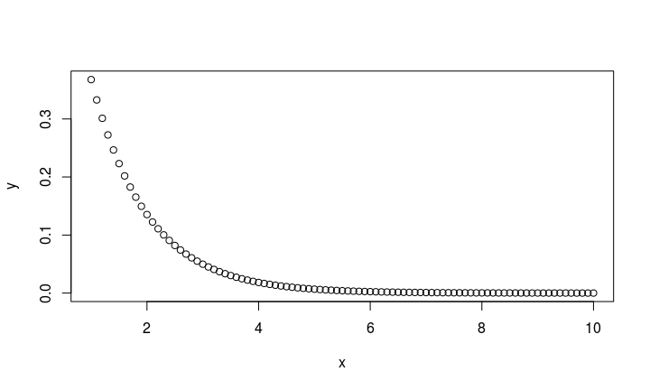

# Aula 02 - Estruturas de dados e vocabulário
Curso de R: Do casual ao avançado  
21 de janeiro de 2015  


## Funções

- Funções também são objetos! (tudo à esquerda de `<-` vira objeto no R)
- Funções podem ser passadas como argumentos de outras funções
- Use suas funções como se tivessem vindas com o R: `nome_da_funcao(...)`
- Crie uma função sempre que for repetir o código e for mudar poucas coisas entre essas repetições
- Crie funções se esta puder ser generalizada para a tarefa específica em que sua implementação foi motivada

## Funções

**Parâmetros**


```r
### <b>
nome_da_funcao <- function(<parâmetros>) {
### </b>
  # faz coisas com os parâmetros
  resultado
}
```

- Parâmetros são objetos cujos valores devem ser atribuídos pelo usuário
- Funções aceitam quantos parâmetros precisar, e de qualquer tipo, inclusive nada (`NULL`)
- Os nomes dos parâmetros se tornarão objetos que só poderão ser usados dentro da função

## Funções

**Parâmetros opcionais**

Podemos definir parâmetros que possuem valores "padrão".


```r
# função que ecoa uma palavra
ecoar <- function(palavra, n_ecos = 3) {
    paste(c(rep(palavra, n_ecos), "!"), collapse = " ")
}

ecoar("eco")
```

```
## [1] "eco eco eco !"
```

```r
ecoar("eco", 5)
```

```
## [1] "eco eco eco eco eco !"
```

## Funções

**Parâmetros relativos**

Um parâmetro pode usar outro parâmetro como valor padrão.


```r
# Função que desenha um histograma
### <b>
histograma <- function(numeros, xlab = "x", 
                       titulo = paste("Histograma de", xlab)) {
### </b>
  hist(numeros, xlab = xlab, main = titulo)
}
```

O parâmetro `titulo` usa o parâmetro `xlab` para compor seu valor padrão.


## Funções

**Ordem ou nome dos parâmetros**

Funções entenderão os parâmetros passados...

- se forem passados com o nome, mesmo que fora da ordem
- se forem passados na ordem, mesmo que sem o nome
- se não houver ambiguidade, o R aceita parte do nome do parâmetro


```r
# As quatro linhas abaixo resultam no mesmo gráfico
histograma(altura, "altura")                  # na ordem
histograma(numeros = altura, xlab = "altura") # pelo nome
histograma(xlab = "altura", altura)           # pelo nome e depois na ordem
histograma(altura, xl = "altura")             # parte do nome
```


## Funções

**Parâmetro '...'**

Utilidade 2: os parâmetros extras serão passados a uma terceira função que tem muitos parâmetros


```r
histograma <- function(numeros, xlab = "x", 
                       titulo = paste("Histograma de", xlab), ...) {
  hist(numeros, xlab = xlab, main = titulo, ...)
}

# parâmetros extras para hist()
histograma(altura, breaks = 100, col = 2)
```

Passamos `breaks` e `col` à função `histograma()` que repassou à função `hist()`.


## Funções

**Escopo**


```r
(x <- exp(1))
```

```
## [1] 2.718
```

```r
f <- function(x) print(x)
f(2)
```

```
## [1] 2
```

```r
g <- function(y) print(x)
g(2)
```

```
## [1] 2.718
```

## Funções

**Escopo**

- Objetos moram em **ambientes** (*environments*)
- As funções as procuram os objetos que precisam usar nesses *environments*
- A ordem de procura segue a regra do mais específico até o ambiente global (`.GlobalEnv`)
- Se nada for encontrado, retorna um erro
- Se houver dois objetos com o mesmo nome, prevalece o mais específico (o primeiro que for encontrado)

## Variáveis aleatórias {.build}


```r
dnorm(x, mean = 0, sd = 1, log = FALSE)
pnorm(q, mean = 0, sd = 1, lower.tail = TRUE, log.p = FALSE)
qnorm(p, mean = 0, sd = 1, lower.tail = TRUE, log.p = FALSE)
rnorm(n, mean = 0, sd = 1)
```

## Variáveis aleatórias

- **d** ("density") Densidade da Normal, ou f.d.p da Normal
- **p** ("probability") Função de distribuição acumulada (f.d.a) da Normal
- **q** ("quantile") Quantil da Normal
- **r** ("random") Gera um número vindo de uma Normal

## Variáveis aleatórias {.smaller}

No lugar de `norm`, você pode trocar por outra distribuição de probabilidade.


|  Distribuição  |  Apelido  |
|:--------------:|:---------:|
|     Normal     |   norm    |
|    Uniforme    |   unif    |
|      Beta      |   beta    |
|  Chi Quadrado  |   chisq   |
|  Exponencial   |    exp    |
| F de Snedecor  |     f     |
|      Gama      |   gamma   |
|    Poisson     |   pois    |


## Vocabulário


## Vocabulário {.smaller}

**Matemática**


|    Função    |        Descrição        |
|:------------:|:-----------------------:|
|    log(x)    | Logaritmo natural de x  |
|    exp(x)    |      e elevado a x      |
|    abs(x)    |   valor absoluto de x   |
|   sign(x)    |  sinal de x (1 ou -1)   |
|   sqrt(x)    |   raiz quadrada de x    |
| choose(n, k) | combinações de n, k a k |
| factorial(x) |      fatorial de x      |

## Vocabulário

**Estatística**


|        Função         |                  Descrição                  |
|:---------------------:|:-------------------------------------------:|
|        mean(x)        |                 Média de x                  |
|    var(x) / sd(x)     |   Variância / Desvio Padrão amostral de x   |
|      quantile(x)      |                Quantis de x                 |
| cov(x, y) / cor(x, y) | Covariância / Correlação linear entre x e y |

## Vocabulário

**Diversos**


|  Função  |                 Descrição                  |
|:--------:|:------------------------------------------:|
|   x:y    |            Sequencia de x até y            |
|   x=y    |          x recebe y (atribuição)           |
|    ?x    |             documentação de x              |
|   x$y    |         extração de y do objeto x          |
|  x%\*%y  | Multiplicação matricial das matrizes x e y |

## Estruturas de dados no R {.build}

Tipos básicos de estrutura no R:

- **Atomic vector**: homogêneo e unidimensional
- **Matriz**: homogêneo e bidimensional
- **Array**: homogêneo e multidimensional
- **Lista**: heterogêneo 
- **Data frame**: heterogêneo 


**Nota**: em sua implementação, atomic vectors e matrizes são também arrays e data frames são listas.


## Atomic Vectors

Estrutura de objetos mais simples do R, caracterizados por "não ter dimensão"

Tipos de atomic vectos:

- lógico
- integer
- double
- complexo
- character

## Atomic Vectors 

Exemplos:


```r
var1 <- c(1, 2.5, 4.5)
var2 <- c(1L, 6L, 10L)
var3 <- c(TRUE, FALSE, T, F)
var4 <- c("essas são", "algumas strings")
```

**Curiosidade**: na função `c()`, o *c* é de *concatenate*.

## Atomic Vectors {.build}

Para saber qual é o tipo de um objeto, utilizamos a função `typeof()`.


```r
typeof(var1)
```

```
## [1] "double"
```

```r
typeof(var2)
```

```
## [1] "integer"
```

```r
typeof(var3)
```

```
## [1] "logical"
```

```r
typeof(var4)
```

```
## [1] "character"
```

## Atomic Vectors {.build}

As funções `is.integer()`, `is.double()`, `is.logical()`, `is.character()` são usadas para testar se um objeto é de um determinado tipo.


```r
is.integer(var1)
```

```
## [1] FALSE
```

```r
is.double(var1)
```

```
## [1] TRUE
```

```r
is.numeric(var1)
```

```
## [1] TRUE
```

## Atomic Vectors {.build}


```r
is.logical(var3)
```

```
## [1] TRUE
```

```r
is.character(var4)
```

```
## [1] TRUE
```

Note que a função `is.numeric()` retorna `TRUE` tanto para objetos double quanto para integer.

## Coerção

Quando dois tipos de objetos são inseridos uma estrutura homogênea (atomic vectors, arrays ou matrizes), o R converte converterá o objeto para o tipo mais flexível, na ordem:

- logical
- integer
- double
- character

Na lista acima, character é o tipo mais flexível.

## Coerção {.build}


```r
c("a", 1, TRUE, T)
```

```
## [1] "a"    "1"    "TRUE" "TRUE"
```

```r
c(T, 1, F)
```

```
## [1] 1 1 0
```

Isso pode ser útil, por exemplo, para contar o número de TRUEs em um vetor lógico:


```r
sum(c(T, F, T, F, T))
```

```
## [1] 3
```

## Factors

*Factors* são utilizados para armazernar dados categorizados e são caracterizados por:

- conterem apenas valores pré-definidos, chamados *levels*; e
- se basearem num vetor de inteiros.


```r
f <- factor(c("aventura", "terror", "comédia", "drama"))
f
```

```
## [1] aventura terror   comédia  drama   
## Levels: aventura comédia drama terror
```

```r
levels(f)
```

```
## [1] "aventura" "comédia"  "drama"    "terror"
```

Observe que, dentro do objeto, os *levels* são organizados em ordem alfabética.

## Factors {.build}

Sempre tome cuidado ao converter factors em objetos numéricos:


```r
f <- factor(c("2", "3", "1", "10"))
as.numeric(f)
```

```
## [1] 3 4 1 2
```

```r
as.numeric(as.character(f))
```

```
## [1]  2  3  1 10
```

## Matrizes e Arrays

Matrizes e arrays são definidos usando as funções `matrix()` e `array()`.


```r
# Um vetor para descrever todas as dimensões
arr <- array(1:12, c(3,2,2))

# Dois argumentos para determinar o número de linahs e colunas
mat <- matrix(1:6, ncol = 3, nrow = 2)
```

Diferentemente dos atomic vectors, essas estruturas apresentam o atribuito *dimensão*.

**Nota**: observe que uma matriz é um array com duas dimensões.

## Dimmensões e comprimentos

As funções `length()`, `dim()`, `nrow()`, `ncol()` são usadas para determinar o comprimento de cada dimensão de um objeto.

## Dimensões e comprimentos {.build}


```r
dim(c(1,2,3))
```

```
## NULL
```

```r
nrow(c(1,2,3))
```

```
## NULL
```

```r
ncol(c(1,2,3))
```

```
## NULL
```

```r
length(c(1,2,3))
```

```
## [1] 3
```

## Dimensões e comprimentos {.build}


```r
dim(arr)
```

```
## [1] 3 2 2
```

```r
length(arr)
```

```
## [1] 12
```

```r
nrow(arr)
```

```
## [1] 3
```

```r
ncol(arr)
```

```
## [1] 2
```

## Dimensões e comprimentos {.build}


```r
dim(mat)
```

```
## [1] 2 3
```

```r
length(mat)
```

```
## [1] 6
```

```r
nrow(mat)
```

```
## [1] 2
```

```r
ncol(mat)
```

```
## [1] 3
```

## Listas e Data frames

Listas são definidas usando a função `list()`.


```r
lista <- list(
  c(1:5),
  c("homem", "mulher"),
  c(T, F, T),
  list(c(1,2,3), c("a", "b", "c"))
  )
```

Data frames são listas em que todos os elementos têm o mesmo comprimento. São definidos usando a função `data.frame()`.


```r
df <- data.frame(x = 1:4, y = c("oi", "oi", "oi", "oi"), z = T)
```

## Diferença entre data.frame e matrix

Com o que foi dito até agora, qual é a diferença entre `data.frame` e `matrix`?

No `data.frame` do slide anterior, a variável `z` só foi definida para a primeira linha?

## data.frames e factors {.build}


```r
df <- data.frame(x = 1:4, y = c("oi", "oi", "oi", "oi"), z = T)
str(df)
```

```
## 'data.frame':	4 obs. of  3 variables:
##  $ x: int  1 2 3 4
##  $ y: Factor w/ 1 level "oi": 1 1 1 1
##  $ z: logi  TRUE TRUE TRUE TRUE
```


```r
df <- data.frame(x = 1:4, y = c("oi", "oi", "oi", "oi"), z = T, 
                 stringsAsFactors = F)
str(df)
```

```
## 'data.frame':	4 obs. of  3 variables:
##  $ x: int  1 2 3 4
##  $ y: chr  "oi" "oi" "oi" "oi"
##  $ z: logi  TRUE TRUE TRUE TRUE
```

## data.frames {.build}

Se usarmos a função `names()` obtemos o nome das colunas do data frame. 


```r
names(df)
```

```
## [1] "x" "y" "z"
```

```r
names(df) <- c("a", "b", "c")
names(df)
```

```
## [1] "a" "b" "c"
```

## Combinando data.frames

É possível combinar data frames usando as funções `rbind()` e `cbind()`:


```r
df1 <- data.frame(x = 3:4, y = c("s", "s"), z = T)
df2 <- data.frame(x = 1:2, y = c("n", "n"), z = F)
```

## Combinando data.frames {.build}


```r
rbind(df1, df2)
```

```
##   x y     z
## 1 3 s  TRUE
## 2 4 s  TRUE
## 3 1 n FALSE
## 4 2 n FALSE
```

```r
cbind(df1, df2)
```

```
##   x y    z x y     z
## 1 3 s TRUE 1 n FALSE
## 2 4 s TRUE 2 n FALSE
```

**Nota**: essas funções tammbém funcionam com matrizes

## Subsetting {.build}

Chamamos de *subsetting* a seleção de um subconjunto de um objeto. No R, existem três tipos principais de operação de subsetting:

- Números inteiros positivos
- Números inteiros negativos
- Vetores lógicos

## Números inteiros positivos {.build}


```r
x <- c(13, 8, 5, 3, 2, 1, 1) 
x[c(1,2,3)]
```

```
## [1] 13  8  5
```

```r
order(x)
```

```
## [1] 6 7 5 4 3 2 1
```

```r
x[order(x)]
```

```
## [1]  1  1  2  3  5  8 13
```

## Números inteiros negativos {.build}


```r
x[-c(2, 5,6)]
```

```
## [1] 13  5  3  1
```

## Vetores lógicos {.build}


```r
x == 1
```

```
## [1] FALSE FALSE FALSE FALSE FALSE  TRUE  TRUE
```

```r
x[x==1]
```

```
## [1] 1 1
```

```r
x > 5
```

```
## [1]  TRUE  TRUE FALSE FALSE FALSE FALSE FALSE
```

```r
x[x>5]
```

```
## [1] 13  8
```

## Outras dimensões {.build}


```r
m <- matrix(c(1:5, 11:15), nrow=5, ncol=2)
m
```

```
##      [,1] [,2]
## [1,]    1   11
## [2,]    2   12
## [3,]    3   13
## [4,]    4   14
## [5,]    5   15
```

## Outras dimensões {.build}


```r
m[5,2] # Retorna o elemento especificado pelos índices.
```

```
## [1] 15
```

```r
m[,1] # Retorna todos os elementos da coluna 1.
```

```
## [1] 1 2 3 4 5
```

```r
m[3,] # Retorna todos os elementos da linha 3.
```

```
## [1]  3 13
```

```r
m[m%%2 == 0] # Retorna os elementos pares.
```

```
## [1]  2  4 12 14
```

## Alterando valores usando subsetting {.build}


```r
x <- c(13, 8, 5, 3, 2, 1, 1) 
x[x>5] <- 0
x
```

```
## [1] 0 0 5 3 2 1 1
```

## Leitura de dados

Para ler um banco de dados no R usamos a função `read.table()`. A seguir estão os principais argumentos dessa função e sua descrição:


```r
help(read.table)
```

## Ler arquivo no R

Vá para o R!

## Estatísticas básicas

Vá para o R!

## Operador pipe %>%

O logo do nosso curso!
o operador `%>%` usa o resultado do seu lado esquerdo como primeiro argumento da função do lado direito. "Só" isso!
Para usar o operador `%>%`, primeiramente devemos instalar o pacote `magrittr` com a função `install.packages()`

```r
install.packages("magrittr")
```
e carregá-lo com a função `library()`

```r
library(magrittr)
```

## Uso do %>%  {.build}


```r
x <- c(1,2,3,4)
x %>% sum %>% sqrt
```

```
## [1] 3.162
```

```r
sqrt(sum(x))
```

```
## [1] 3.162
```

## Uso do %>% 


```r
esfrie(asse(coloque(bata(acrescente(recipiente(
  rep("farinha", 2), "água", "fermento", "leite", "óleo"), 
  "farinha", até = "macio"), duração = "3min"), 
  lugar = "forma", tipo = "grande", 
  untada = T), duração = "50min"), "geladeira", "20min")
```

## Uso do %>% 


```r
recipiente(rep("farinha", 2), "água", "fermento", "leite", "óleo") %>%
  acrescente("farinha", até = "macio") %>%
  bata(duração = "3min") %>%
  coloque(lugar = "forma", tipo = "grande", untada = T) %>%
  asse(duração = "50min") %>%
  esfrie("geladeira", "20min")
```

## Uso do %>% {.build}


```r
T %>% mean(c(NA, rnorm(100)), na.rm = .)
```

```
## [1] -0.05766
```

```r
F %>% mean(c(NA, rnorm(100)), na.rm = .)
```

```
## [1] NA
```

## Gráficos simples


```r
x <- seq(1, 10, 0.1)
y <- exp(-x)

plot(x, y)
```

 

## plyr

principal objetivo: esconder loops tornando o código mais legível e menos repetitivo


```r
library(plyr)
```

## plyr


```r
mat <- matrix(rnorm(300), ncol = 3)
m <- numeric(length = ncol(mat))
for (i in 1:ncol(mat)){
  m[i] <- mean(mat[,i])
}
m
```

```
## [1] -0.05498 -0.12054 -0.10149
```


```r
aaply(mat, 2, mean)
```

```
##        1        2        3 
## -0.05498 -0.12054 -0.10149
```

## plyr


```r
df <- data.frame(x = sample(1:4, size = 100, replace = T), y = rnorm(100))

m <- numeric(length = length(unique(df$x)))
for(i in unique(df$x)){
  m[i] <- mean(df$y[df$x == i])
}
m
```

```
## [1] -0.01333  0.11788  0.36145 -0.30979
```


```r
library(magrittr)
daply(df, .(x), colwise(mean)) %>% as.numeric()
```

```
## [1] -0.01333  0.11788  0.36145 -0.30979
```


