# Aula 05 - ggplot2
Curso de R: Do casual ao avançado  
2015-01-26  


## Introdução {.build}

O que é um gráfico estatísstico? 

Leland Wilkinson respondeu essa pergunta!

- Conjunto de dados

- Aspectos estéticos

- Formas geométricas


## Motivação 1

- é fácil de usar

- foi criado pelo Hardley

- gráficos bonitos e elegantes.

## Motivação 2 | SAS

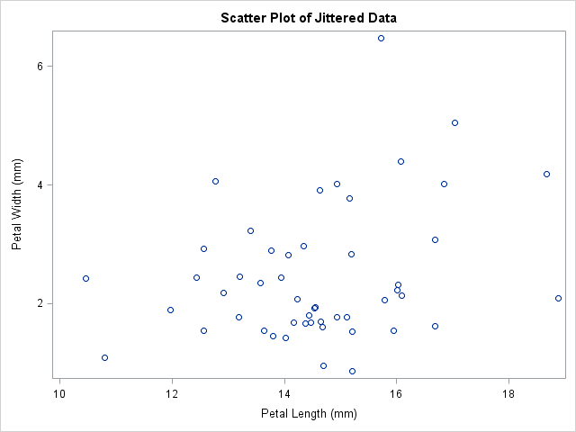

## Motivação 2 | SPSS

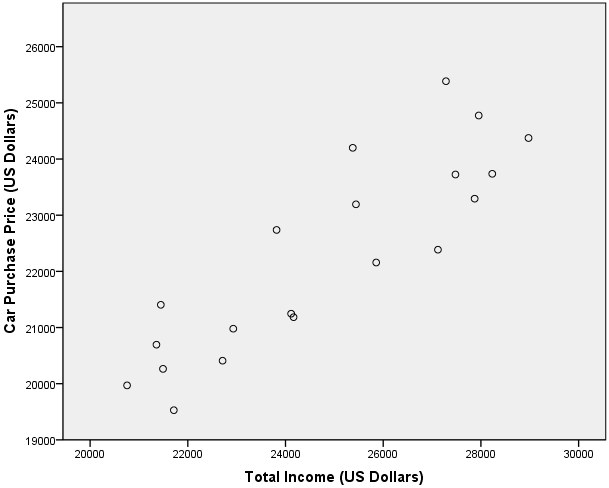

## Motivação 2 | Matlab

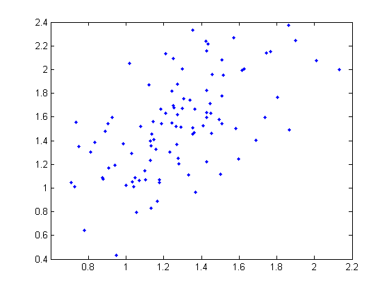

## Motivação 2 | Minitab

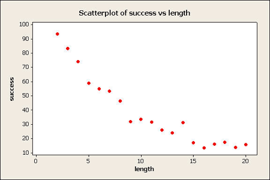

## Motivação 2 | R-base

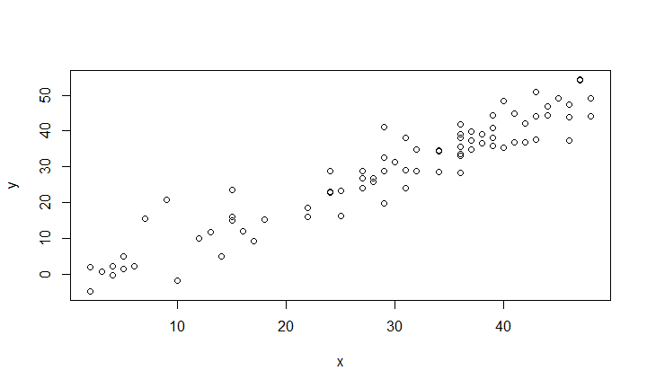 

## Motivação 2 | R-ggplot2

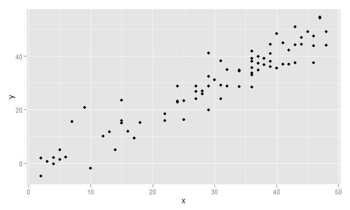 


## Motivação 3

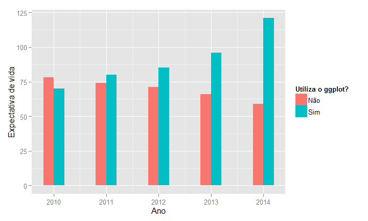 

## Motivação 3

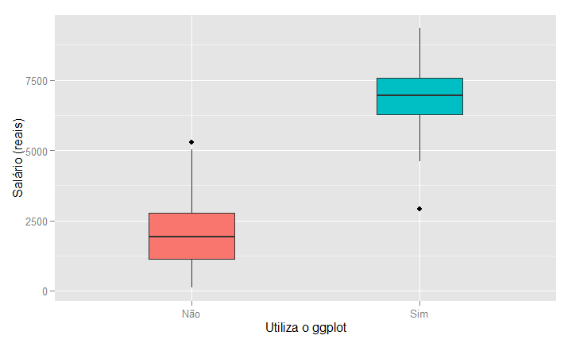 


## Motivação 3

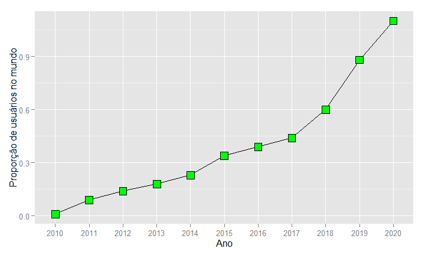 

## Estrutura

- Dados --- `data =`

- Aspectos estéticos (*mapping*) --- `aes()` 

- Formas geométricas --- `geom_()`

- Transformações estatísticas --- `stat =`

## Exemplos


```r
head(mtcars, 10)
```

```
##                    mpg cyl  disp  hp drat    wt  qsec vs am gear carb
## Mazda RX4         21.0   6 160.0 110 3.90 2.620 16.46  0  1    4    4
## Mazda RX4 Wag     21.0   6 160.0 110 3.90 2.875 17.02  0  1    4    4
## Datsun 710        22.8   4 108.0  93 3.85 2.320 18.61  1  1    4    1
## Hornet 4 Drive    21.4   6 258.0 110 3.08 3.215 19.44  1  0    3    1
## Hornet Sportabout 18.7   8 360.0 175 3.15 3.440 17.02  0  0    3    2
## Valiant           18.1   6 225.0 105 2.76 3.460 20.22  1  0    3    1
## Duster 360        14.3   8 360.0 245 3.21 3.570 15.84  0  0    3    4
## Merc 240D         24.4   4 146.7  62 3.69 3.190 20.00  1  0    4    2
## Merc 230          22.8   4 140.8  95 3.92 3.150 22.90  1  0    4    2
## Merc 280          19.2   6 167.6 123 3.92 3.440 18.30  1  0    4    4
```


## Exemplos


```r
ggplot(data = mtcars, aes(x = disp, y = mpg)) +
  geom_point()
```

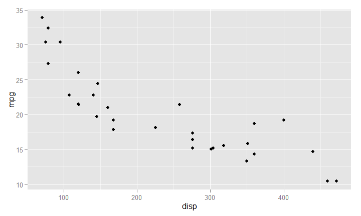 


## Exemplos


```r
ggplot(data = mtcars) +
  geom_point(aes(x = disp, y = mpg))
```

 


## Exemplos


```r
ggplot(data = mtcars) +
  geom_point(aes(x = disp, y = mpg))
```

 


## Exemplos


```r
ggplot(data = mtcars) +
  geom_point(aes(x = disp, y = mpg, colour = as.character(am)))
```

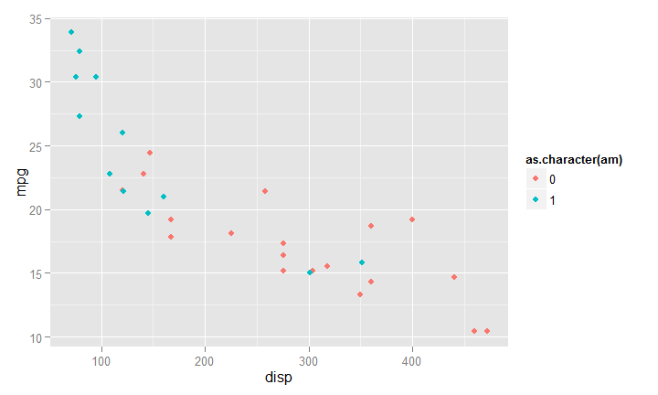 


## Exemplos


```r
ggplot(data = mtcars) +
  geom_point(aes(x = disp, y = mpg, colour = as.character(am),
                                size = cyl))
```

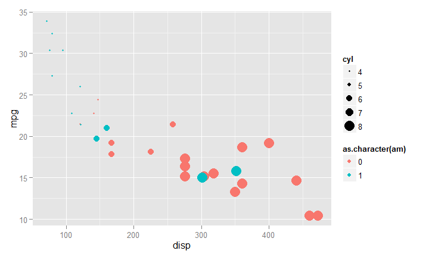 

## Exemplos {.build}


```r
ggplot(data = mtcars) +
  geom_point(aes(x = disp, y = mpg), colour = "blue", size = 5, 
             shape = 2)
```

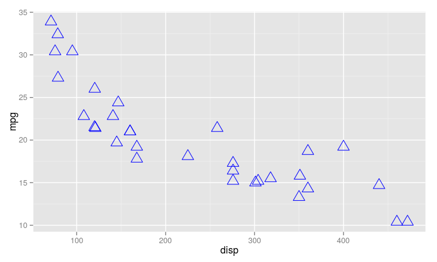 

## Exemplos {.build}


```r
ggplot(data = mtcars) +
  geom_point(aes(x = cyl, y = mpg), stat = "summary", fun.y= mean)
```


```r
ggplot(data = mtcars) +
  geom_point(aes(x = cyl, y = mpg), stat = "summary", fun.y= mean)
```

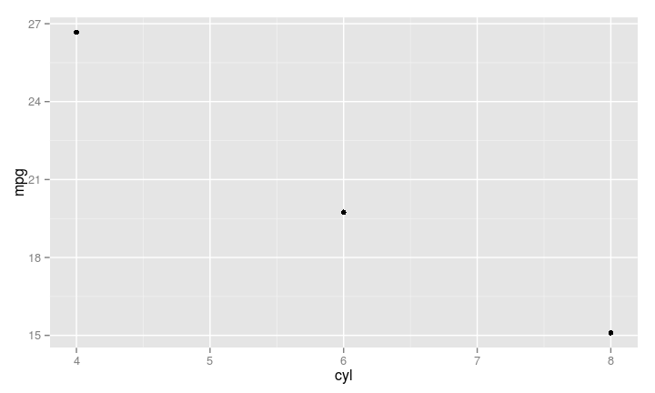 


## Exemplos {.build}


```r
ggplot(data = mtcars) +
  geom_line(aes(x = cyl, y = mpg), stat = "summary", fun.y= mean)
```

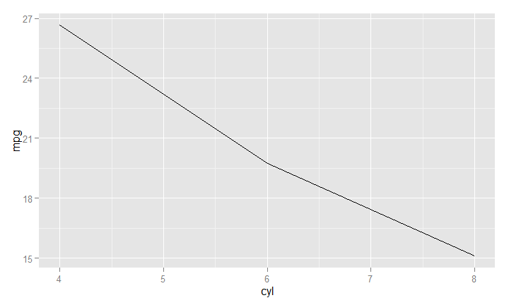 

## Exemplos


```r
ggplot(data = mtcars) +
  geom_line(aes(x = cyl, y = mpg), stat = "summary", fun.y= mean) +
  geom_point(aes(x = cyl, y = mpg), stat = "summary", fun.y= mean)
```

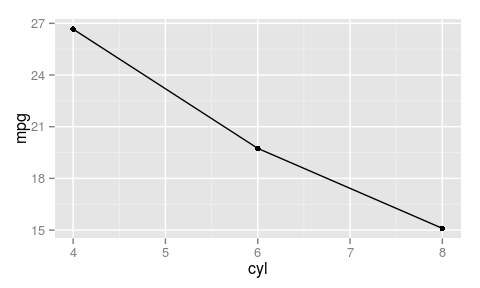 


## Exemplos


```r
ggplot(data = mtcars) +
  geom_boxplot(aes(x = as.character(gear), y = mpg, 
                   fill = as.character(gear)))
```

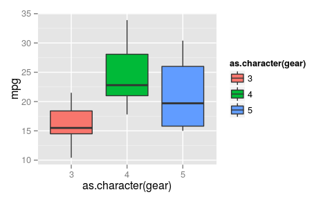 


## Exemplos


```r
ggplot(data = mtcars) +
  geom_boxplot(aes(x = as.character(gear), y = mpg, 
                   fill = as.character(gear))) +
  xlab("") +
  ylab("Milhas por galão") +
  labs(fill="Número de marchas")
```

 

## Desafio {.build}

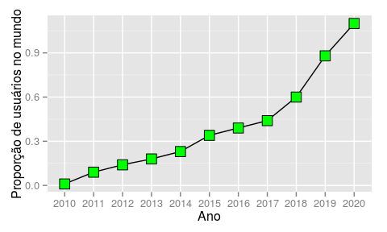 


```r
head(df, 3) # Shape = 22 e Size = 5.
```

```
##    ano prop
## 1 2010 0.01
## 2 2011 0.09
## 3 2012 0.14
```


