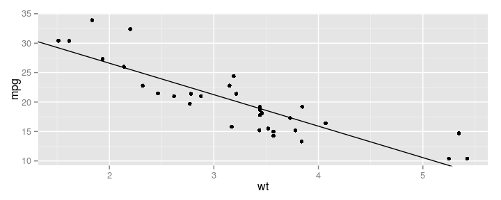
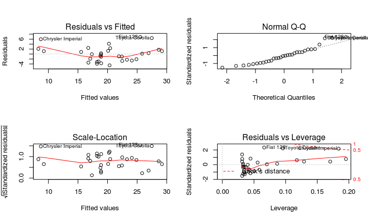
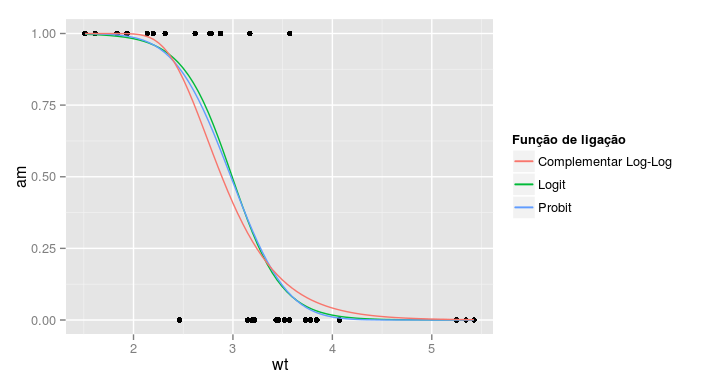
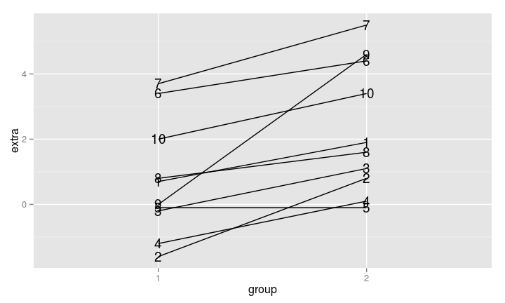
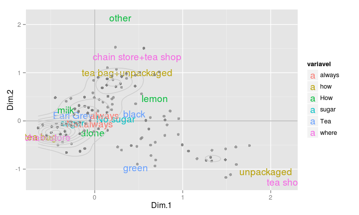

# Aula 07 - Modelando
Curso de R  


## Regressão Linear e ANOVA

- A função que ajusta modelo linear normal no R é `lm()`. 

- Você especifica o:
    - banco de dados; e 
    - a fórmula com as variáveis que deseja associar.
    

```r
ajuste <- lm(resposta ~ explicativas, data = meus_dados)
```

O objeto `ajuste` contém todos os resultados e com a ajuda de alguns comandos, você extrai tudo o que é interessante.

## Regressão Linear e ANOVA {.smaller}

Exemplo:

```r
ajuste_lm <- lm(mpg ~ wt, data = mtcars)
ajuste_lm
```

```
## 
## Call:
## lm(formula = mpg ~ wt, data = mtcars)
## 
## Coefficients:
## (Intercept)           wt  
##      37.285       -5.344
```

- `wt` é uma variável explicativa **contínua** (`numeric`), caracterizando um modelo de regressão. 
- Se `wt` fosse categórica (`factor`), estaríamos ajustando um modelo de ANOVA.

## Regressão Linear e ANOVA {.smaller}

Gráfico da reta ajustada:

```r
# extrai os coeficientes ajustados
coeficientes <- coef(ajuste_lm)

ggplot(mtcars) +
  geom_point(aes(x = wt, y = mpg)) +
  geom_abline(intercept = coeficientes[1], slope = coeficientes[2])
```

 

## Regressão Linear e ANOVA {.smaller}

**summary()**


```r
summary(ajuste_lm)
```


## Regressão Linear e ANOVA {.smaller}

**summary()**

A função `summary()` é uma função genérica que geralmente devolve um resumo de informações úteis de praticamente qualquer classe de objetos. Para objetos `lm()` ela devolve:

1. Chamada do modelo
2. Medidas resumo dos resíduos
3. Tabela de coeficientes, desvios padrão e testes T para hipótese nula de parâmetros iguais a zero.
4. Média dos quadrados do resíduo e os respectivos graus de liberdade; $R^2$ e $R^2$ ajustado da regressão; Estatística F para qualidade do ajuste (comparação com o modelo com apenas o intercepto).

## Regressão Linear e ANOVA {.smaller}

**plot()**

A função `plot()` constrói gráficos úteis para diagnóstico do modelo.


```r
# opção para mostrar 4 gráficos em uma mesma figura
par(mfrow = c(2,2))

# gráficos de diagnóstico do modelo ajuste_lm
plot(ajuste_lm)

# retorna ao normal
par(mfrow = c(1,1))
```


## Regressão Linear e ANOVA {.smaller}

**plot()**

A função `plot()` constrói gráficos úteis para diagnóstico do modelo.

 

## Regressão Linear e ANOVA {.smaller}

**anova()**

Uma parte importante da modelagem é a redução de modelos. 

- A função `anova()` compara dois (ou mais) modelos encaixados por meio da estatística F (por padrão)


```r
# modelo nulo, com apenas o intercepto
ajuste_lm_nulo <- lm(mpg ~ 1, data = mtcars)
# compara o modelo com wt com o modelo nulo
anova(ajuste_lm_nulo, ajuste_lm)
```

## Regressão Linear e ANOVA {.smaller}

**anova()**

Uma parte importante da modelagem é a redução de modelos. 

- A função `anova()` compara dois (ou mais) modelos encaixados por meio da estatística F (por padrão)


```
## Analysis of Variance Table
## 
## Model 1: mpg ~ 1
## Model 2: mpg ~ wt
##   Res.Df     RSS Df Sum of Sq      F    Pr(>F)    
## 1     31 1126.05                                  
## 2     30  278.32  1    847.73 91.375 1.294e-10 ***
## ---
## Signif. codes:  0 '***' 0.001 '**' 0.01 '*' 0.05 '.' 0.1 ' ' 1
```

## Regressão Linear e ANOVA {.smaller}

**anova()**

- Caso seja passada apenas um ajuste à função, ela devolve a tabela de ANOVA (termos testados sequencialmente).


```r
# modelo com wt e cyl
ajuste_lm2 <- lm(mpg ~ wt + cyl, data = mtcars)
anova(ajuste_lm2)
```

## Regressão Linear e ANOVA {.smaller}

**anova()**

- Caso seja passada apenas um ajuste à função, ela devolve a tabela de ANOVA (termos testados sequencialmente).


```
## Analysis of Variance Table
## 
## Response: mpg
##           Df Sum Sq Mean Sq F value    Pr(>F)    
## wt         1 847.73  847.73  128.60 3.535e-12 ***
## cyl        1  87.15   87.15   13.22  0.001064 ** 
## Residuals 29 191.17    6.59                      
## ---
## Signif. codes:  0 '***' 0.001 '**' 0.01 '*' 0.05 '.' 0.1 ' ' 1
```

O valor-p = 0.001064 indica que o modelo com `wt + cyl` trás melhorias significantes no poder explicativo do modelo quando comparado ao modelo com apenas `wt`. 

## Regressão Linear e ANOVA {.smaller}

**stepwise**

Stepwise no R se faz com as funções `step()` do pacote `stats` ou `stepAIC()` do pacote `MASS`. Escolher entre `forward`, `backward` ou `both` (ambos) basta passar um desses nomes ao parâmetro `direction` da função.


```r
# modelo aditivo completo
ajuste_lm_completo <- lm(mpg ~ ., data = mtcars)

# modelo forward
step(ajuste_lm_completo, direction = "forward")

# modelo backward
step(ajuste_lm_completo, direction = "backward")

# modelo both
step(ajuste_lm_completo, direction = "both")
```

## Regressão Linear e ANOVA {.smaller}

**demais comandos**

Outros comandos úteis são:


|      Função       |                  Descrição                  |
|:-----------------:|:-------------------------------------------:|
|     confint()     |  Intervalo de confiança para os parâmetros  |
|      resid()      |             Resíduos do modelo              |
|     fitted()      |              Valores ajustados              |
|       AIC()       |      Critério de informação de Akaike       |
|  model.matrix()   | Matriz de planejamento (matriz X) do modelo |
| linearHypotesis() | Teste de combinações lineares de parâmetros |

## Regressão Linear Generalizada

MLG no R é igualmente fácil. Mudamos de `lm()` para `glm()` e acrescentamos a família de distribuições que queremos assumir para a resposta.

Situação:

- Suposição de normalidade não se verifica; e/ou 
- Homocedasticidade não se sustenta

Alternativa: regressão logística/Poisson/Gama...

## Regressão Linear Generalizada

**Modelo**

$$
Y_i \sim F(\mu_i, \phi)
$$

$$
\mu_i = g^{-1}(\alpha + \beta_1 x_{i1} + \beta_p x_{ip})
$$

## Regressão Linear Generalizada

**Estrutura**


```r
ajuste_glm <- glm(resposta ~ explicativas, 
                  data = dados, 
                  family = distribuicao)
```

Para ver a lista de distribuições que podem ser passadas ao parâmetro `family`, rode `?family` no R.

## Regressão Linear Generalizada

**Função de ligação**

Outro componente importante em modelos lineares generalizados é a função de ligação. De modo mais geral, o código para ajsutar um MLG fica assim:


```r
ajuste_glm <- glm(resposta ~ explicativas, 
                  data = dados, 
                  family = distribuicao(link = funcao_de_ligacao))
```

Repare na parte `(link = funcao_de_ligacao)` depois do nome da distribuição escolhida.

## Regressão Linear Generalizada

**Função de ligação**

Uma prática comum é trocar a ligação `inversa` de uma regressão Gama para uma ligação `log`, por exemplo. 

No R, fica:


```r
ajuste_gama <- glm(Y ~ X + I(X^2) + Z, 
                   data = dados, 
                   family = Gamma(link = "log"))
```

**OBS** Todas as funções úteis para `lm()` continuam sendo úteis para `glm()`.


## Regressão Linear Generalizada {.smaller}

**Exemplo: Regressão logística**

A regressão logística se caracteriza por assumir distribuição binomial à variável resposta. 


```r
# Regressão logistica: Ligação logit
ajuste_glm <- glm(am ~ wt, data = mtcars, family = binomial)
table(mtcars$am, predict(ajuste_glm) > 0.5)
```

```
##    
##     FALSE TRUE
##   0    18    1
##   1     3   10
```

## Regressão Linear Generalizada 

**Exemplo: Regressão logística**

- Por padrão, a função de ligação da distribuição `binomial` é a `logit`. 
- Se quisermos usar a função `probit`, precisamos especificar isto no parâmetro `family`.


```r
# Ligaçao probit
ajuste_glm_probit <- glm(am ~ wt, 
                         data = mtcars, 
                         family = binomial(link = "probit"))
```

## Regressão Linear Generalizada

**Exemplo: Regressão logística**

Gráfico das curvas ajustadas:
 

## Regressão Linear Generalizada {.smaller}

**Exemplo: Regressão logística**

O teste Chi quadrado é mais indicado para regressão logística.


```r
anova(ajuste_glm, test="Chisq")
```

```
## Analysis of Deviance Table
## 
## Model: binomial, link: logit
## 
## Response: am
## 
## Terms added sequentially (first to last)
## 
## 
##      Df Deviance Resid. Df Resid. Dev  Pr(>Chi)    
## NULL                    31     43.230              
## wt    1   24.054        30     19.176 9.369e-07 ***
## ---
## Signif. codes:  0 '***' 0.001 '**' 0.01 '*' 0.05 '.' 0.1 ' ' 1
```

## Modelos mistos

- Medidas Repetidas
- Dados longitudinais
- Observações dependentes
## Modelos mistos

**Estrutura**


```r
library(lme4)
ajuste_lmer <- lmer(resposta ~ explicativas + (form_ind|individuo), 
                    data = dados)
```

`form_ind` é a fórmula de como você quer ajustar o modelo para cada indivíduo (geralmente `1`, que é apenas intercepto aleatório) e `individuo` é a variável que identifica o indivíduo. 

## Modelos mistos

**Exemplo: Teste t pareado**

- Teste t pareado: comparar médias
- Banco de dados `sleep`.

 

## Modelos mistos

**Exemplo: Teste t pareado**

Teste t pareado

```r
aux <- sleep %>% mutate(group=paste0('droga_', group)) %>% spread(group, extra)
t.test(aux$droga_1, aux$droga_2, paired=TRUE)
```

```
## 
## 	Paired t-test
## 
## data:  aux$droga_1 and aux$droga_2
## t = -4.0621, df = 9, p-value = 0.002833
## alternative hypothesis: true difference in means is not equal to 0
## 95 percent confidence interval:
##  -2.4598858 -0.7001142
## sample estimates:
## mean of the differences 
##                   -1.58
```

## Modelos mistos

**Exemplo: Teste t pareado**

Modelo misto equivalente


```r
modelo <- lmer(extra ~ group + (1|ID), data=sleep)
summary(modelo)
```

```
## Linear mixed model fit by REML ['lmerMod']
## Formula: extra ~ group + (1 | ID)
##    Data: sleep
## 
## REML criterion at convergence: 70
## 
## Scaled residuals: 
##      Min       1Q   Median       3Q      Max 
## -1.63372 -0.34157  0.03346  0.31511  1.83859 
## 
## Random effects:
##  Groups   Name        Variance Std.Dev.
##  ID       (Intercept) 2.8483   1.6877  
##  Residual             0.7564   0.8697  
## Number of obs: 20, groups:  ID, 10
## 
## Fixed effects:
##             Estimate Std. Error t value
## (Intercept)   0.7500     0.6004   1.249
## group2        1.5800     0.3890   4.062
## 
## Correlation of Fixed Effects:
##        (Intr)
## group2 -0.324
```

## Árvore de Decisão

- arvores de decisão unem simplicidade com eficiência. 
- No R seu ajuste é tão simples quanto ajustar um modelo de regressão.
- Possui um conjunto de funções igualmente convenientes para extrair resultados, basta conhecê-los (e iremos).

## Árvore de Decisão {.smaller}

- Vamos apresentar como ajustar arvore de decisão usando o pacote `tree`. 
- Porém, como tudo no R, existe inúmeros pacotes e jeitos de ajustar uma arvore de decisão (ver este [link](http://statistical-research.com/a-brief-tour-of-the-trees-and-forests/?utm_source=rss&utm_medium=rss&utm_campaign=a-brief-tour-of-the-trees-and-forests)).

**Ajuste**


```r
library(tree)
ajuste_tree <- tree(factor(am) ~ wt, data = mtcars)
summary(ajuste_tree)
```

## Árvore de Decisão {.smaller}

- Vamos apresentar como ajustar arvore de decisão usando o pacote `tree`. 
- Porém, como tudo no R, existe inúmeros pacotes e jeitos de ajustar uma arvore de decisão (ver este [link](http://statistical-research.com/a-brief-tour-of-the-trees-and-forests/?utm_source=rss&utm_medium=rss&utm_campaign=a-brief-tour-of-the-trees-and-forests)).

**Ajuste**


```
## 
## Classification tree:
## tree(formula = factor(am) ~ wt, data = mtcars)
## Number of terminal nodes:  5 
## Residual mean deviance:  0.4955 = 13.38 / 27 
## Misclassification error rate: 0.09375 = 3 / 32
```

## Árvore de Decisão

- Vamos apresentar como ajustar arvore de decisão usando o pacote `tree`. 
- Porém, como tudo no R, existe inúmeros pacotes e jeitos de ajustar uma arvore de decisão (ver este [link](http://statistical-research.com/a-brief-tour-of-the-trees-and-forests/?utm_source=rss&utm_medium=rss&utm_campaign=a-brief-tour-of-the-trees-and-forests)).

**Grafico**


```r
plot(ajuste_tree)
text(ajuste_tree, pretty = 0)
```

## Árvore de Decisão

- Vamos apresentar como ajustar arvore de decisão usando o pacote `tree`. 
- Porém, como tudo no R, existe inúmeros pacotes e jeitos de ajustar uma arvore de decisão (ver este [link](http://statistical-research.com/a-brief-tour-of-the-trees-and-forests/?utm_source=rss&utm_medium=rss&utm_campaign=a-brief-tour-of-the-trees-and-forests)).

**Grafico**

 

## Árvore de Decisão

**comparação entre os modelos logístico e arvore**

Tabelas de observado versus predito:

```r
# Logistico
table(mtcars$am, predict(ajuste_glm) > 0.5)

# arvore
table(mtcars$am, predict(ajuste_tree)[,"1"] > 0.5)
```

## Árvore de Decisão

**Cross-validation**

- arvores tendem a "super-ajustar" (*overfit*) o modelo. 
- Para evitar este problema, *cross-validation* é uma boa pratica. 
- *Cross-validation* consiste em reservar parte da base reservada para depois ser usada para calcular o erro preditivo do modelo.
- O erro preditivo vira o novo critério de parada para a "podagem" da arvore.

## Árvore de Decisão

**Cross-validation**

Para fazer isso é muito facil com a função `cv.tree()`. Basta passar seu modelo ajustado para ela:


```r
set.seed(123)
cv_tree <- cv.tree(ajuste_tree)
plot(cv_tree)
```

## Árvore de Decisão

**Cross-validation**

Para fazer isso é muito facil com a função `cv.tree()`. Basta passar seu modelo ajustado para ela:

 

O grafico mostra qual tamanho da arvore que apresentou o menor erro de predição. No nosso caso foi tamanho `2`.

## Árvore de Decisão

**Cross-validation**

Para recuperar esse ajuste de tamanho `2`, chamamos a função `prune.tree()` da seguinte forma:


```r
# seleciona a arvoore com 2 nós
melhor_tree <- prune.tree(ajuste_tree, best = 2)
# Grafico que representa a arvore `melhor_tree`
plot(melhor_tree)
text(melhor_tree, pretty = 0)
```

## Árvore de Decisão

**Cross-validation**

Para recuperar esse ajuste de tamanho `2`, chamamos a função `prune.tree()` da seguinte forma:

 

## Árvore de Decisão {.smaller}

**Cross-validation**

Para recuperar esse ajuste de tamanho `2`, chamamos a função `prune.tree()` da seguinte forma:

```r
table(mtcars$am, predict(ajuste_tree)[,"1"] > 0.5) # tamanho 5
```

```
##    
##     FALSE TRUE
##   0    17    2
##   1     1   12
```

```r
table(mtcars$am, predict(melhor_tree)[,"1"] > 0.5) # tamanho 2
```

```
##    
##     FALSE TRUE
##   0    17    2
##   1     1   12
```

O modelo `melhor_tree` coincidiu com o `ajuste_tree` (que tinha tamanho `5`)

## Árvore de Decisão

**Parâmetros de controle**

- arvores de decisão são ajustadas sob alguns critérios que às vezes precisamos reconfigurar. 
- O `ajuste_tree` tinha muito mais galho do que o necessario. Isso se deveu a critérios de divisão/parada desregulados. 
- Objetos `tree` dois parâmetros importantes: `split` e `control`.

## Árvore de Decisão

**split**

O parâmetro `split` define qual o critério para decidir se divide o "galho" ou não. Por padrão, a função utiliza o critério "deviance", que tem a mesma definição do MLG. Uma segunda opção seria **Gini**.

**control**

O parâmetro `control` recebe um objeto retornado pela função `tree.control()`.

## Árvore de Decisão

**control**

`tree.control()` permite você configurar:

- `nobs` Número de observações na base de treino. Isso sera efetivo no `cv.tree()`, quando uma base de treino e outra de teste é utilizada para calcular o erro de predição por meio de *cross-validation*.
- `mincut` Número mínimo de observações a serem incluídas em cada nó.
- `minsize` O menor tamanho de nó permitido.
- `mindev` Fração mínima do deviance do nó raiz.

## Árvore de Decisão

**control**

Como passar à função:

```r
controles <- tree.control(nobs = 32, mincut = 10)
ajuste_tree <- ajuste_tree <- tree(factor(am) ~ wt, 
                                   data = mtcars, 
                                   control = controles)
plot(ajuste_tree);text(ajuste_tree, pretty = 0)
```

## Análise de Agrupamento

- Agrupa indivíduos com base nas variáveis
- Métodos _hierárquico_ e _k-means_. 

## K-means

- Selecionar previamente número de grupos.
- Função `kmeans` do pacote `stats`.


```r
kms <- kmeans(mtcars, centers=2)
kms
```

```
## K-means clustering with 2 clusters of sizes 14, 18
## 
## Cluster means:
##        mpg      cyl     disp        hp     drat       wt     qsec
## 1 15.10000 8.000000 353.1000 209.21429 3.229286 3.999214 16.77214
## 2 23.97222 4.777778 135.5389  98.05556 3.882222 2.609056 18.68611
##          vs        am     gear     carb
## 1 0.0000000 0.1428571 3.285714 3.500000
## 2 0.7777778 0.6111111 4.000000 2.277778
## 
## Clustering vector:
##           Mazda RX4       Mazda RX4 Wag          Datsun 710 
##                   2                   2                   2 
##      Hornet 4 Drive   Hornet Sportabout             Valiant 
##                   2                   1                   2 
##          Duster 360           Merc 240D            Merc 230 
##                   1                   2                   2 
##            Merc 280           Merc 280C          Merc 450SE 
##                   2                   2                   1 
##          Merc 450SL         Merc 450SLC  Cadillac Fleetwood 
##                   1                   1                   1 
## Lincoln Continental   Chrysler Imperial            Fiat 128 
##                   1                   1                   2 
##         Honda Civic      Toyota Corolla       Toyota Corona 
##                   2                   2                   2 
##    Dodge Challenger         AMC Javelin          Camaro Z28 
##                   1                   1                   1 
##    Pontiac Firebird           Fiat X1-9       Porsche 914-2 
##                   1                   2                   2 
##        Lotus Europa      Ford Pantera L        Ferrari Dino 
##                   2                   1                   2 
##       Maserati Bora          Volvo 142E 
##                   1                   2 
## 
## Within cluster sum of squares by cluster:
## [1] 93643.90 58920.54
##  (between_SS / total_SS =  75.5 %)
## 
## Available components:
## 
## [1] "cluster"      "centers"      "totss"        "withinss"    
## [5] "tot.withinss" "betweenss"    "size"         "iter"        
## [9] "ifault"
```

## Hierárquico

- Ordena a aglomeração dos indivíduos.
- Baseado em matriz de dissimilaridades.
- Vários métodos de aglomeração.

## Hierárquico

**Distâncias**


```r
d <- dist(mtcars) # calcula matriz de distâncias euclidianas.
str(d)
```

```
## Class 'dist'  atomic [1:496] 0.615 54.909 98.113 210.337 65.472 ...
##   ..- attr(*, "Size")= int 32
##   ..- attr(*, "Labels")= chr [1:32] "Mazda RX4" "Mazda RX4 Wag" "Datsun 710" "Hornet 4 Drive" ...
##   ..- attr(*, "Diag")= logi FALSE
##   ..- attr(*, "Upper")= logi FALSE
##   ..- attr(*, "method")= chr "euclidean"
##   ..- attr(*, "call")= language dist(x = mtcars)
```

## Hierárquico

**Algoritmo**


```r
hc <- hclust(d, method='ward.D')
hc
```

```
## 
## Call:
## hclust(d = d, method = "ward.D")
## 
## Cluster method   : ward.D 
## Distance         : euclidean 
## Number of objects: 32
```

## Hierárquico

**Dendrograma**


```r
hc <- hclust(d, method='ward.D')
plot(hc)
```

 

## Análise Fatorial

- Redução de dimensionalidade.
- Identificação de "variáveis latentes".
- Função `factanal` do pacote `stats` (ajusta por MV).
- Rotação para isolar efeitos das variáveis.

## Análise Fatorial

**Ajuste**


```r
fa <- factanal(mtcars, factors=3, rotation='none')
fa
```

```
## 
## Call:
## factanal(x = mtcars, factors = 3, rotation = "none")
## 
## Uniquenesses:
##   mpg   cyl  disp    hp  drat    wt  qsec    vs    am  gear  carb 
## 0.135 0.055 0.090 0.127 0.290 0.060 0.051 0.223 0.208 0.125 0.158 
## 
## Loadings:
##      Factor1 Factor2 Factor3
## mpg  -0.910   0.137  -0.136 
## cyl   0.962          -0.135 
## disp  0.937  -0.174         
## hp    0.875   0.292   0.147 
## drat -0.689   0.453   0.175 
## wt    0.858  -0.382   0.242 
## qsec -0.591  -0.754   0.177 
## vs   -0.809  -0.309   0.164 
## am   -0.522   0.719         
## gear -0.459   0.729   0.365 
## carb  0.594   0.517   0.471 
## 
##                Factor1 Factor2 Factor3
## SS loadings      6.448   2.465   0.565
## Proportion Var   0.586   0.224   0.051
## Cumulative Var   0.586   0.810   0.862
## 
## Test of the hypothesis that 3 factors are sufficient.
## The chi square statistic is 30.53 on 25 degrees of freedom.
## The p-value is 0.205
```

## Análise Fatorial

**Gráfico**

 

## Análise de correspondência múltipla

- Componentes principais para variáveis categóricas.
- Bom para exploratória inicial, pois sumariza diversas tabelas de contingência.
- Função `MCA` do pacote `FactoMineR`.

## Análise de correspondência múltipla
**Base de dados tea**


```r
data(tea)
newtea <- tea %>% select(Tea, How, how, sugar, where, always) %>% tbl_df
newtea
```

```
## Source: local data frame [300 x 6]
## 
##          Tea   How                how    sugar                where
## 1      black alone            tea bag    sugar          chain store
## 2      black  milk            tea bag No.sugar          chain store
## 3  Earl Grey alone            tea bag No.sugar          chain store
## 4  Earl Grey alone            tea bag    sugar          chain store
## 5  Earl Grey alone            tea bag No.sugar          chain store
## 6  Earl Grey alone            tea bag No.sugar          chain store
## 7  Earl Grey alone            tea bag No.sugar          chain store
## 8      black  milk            tea bag No.sugar          chain store
## 9  Earl Grey  milk tea bag+unpackaged No.sugar chain store+tea shop
## 10     black alone tea bag+unpackaged No.sugar chain store+tea shop
## ..       ...   ...                ...      ...                  ...
## Variables not shown: always (fctr)
```


## Análise de correspondência múltipla

**Ajuste do MCA**


```r
mca <- MCA(newtea, graph = FALSE)
cats <- newtea %>% summarise_each(funs(length(unique(.))))
mca1_vars_df <- data.frame(mca$var$coord, variavel=rep(names(cats), cats), stringsAsFactors=F) %>%
  mutate(rnames=row.names(.))
mca1_obs_df <- data.frame(mca$ind$coord)
```

## Análise de correspondência múltipla

**Gráfico**

 

## Demais técnicas {.smaller}

- Modelos de Sobrevivência
- Analise de Agrupamento
- Analise de Componentes Principais
- Dados longitudinais
- Séries temporais
- Dados categorizados
- GAM/GAMLSS
- Inferência Bayesiana
- Processos estocasticos
- Reamostragem

## Referências

http://www-bcf.usc.edu/~gareth/ISL/ISLR%20First%20Printing.pdf

http://web.stanford.edu/~hastie/local.ftp/Springer/OLD/ESLII_print4.pdf

http://www.ime.usp.br/~giapaula/texto_2013.pdf

Colosimo, E.A. e Giolo, S.R. (2006) Analise de sobrevivência aplicada. ABE - Projeto Fisher, Edgard Blücher.

http://adv-r.had.co.nz/Functions.html

http://www.burns-stat.com/pages/Tutor/R_inferno.pdf
