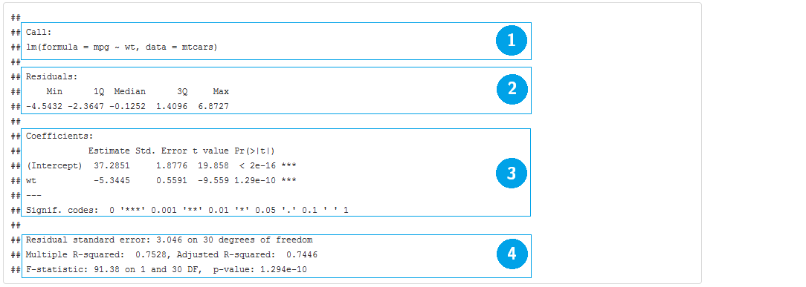

```{r, echo=FALSE, warning=FALSE, message=FALSE}
library(pander)
library(lme4)
library(FactoMineR)
library(ggplot2)
library(magrittr)
library(tidyr)
library(dplyr)
panderOptions("table.style", "rmarkdown")
```

## Regressão Linear e ANOVA

- A função que ajusta modelo linear normal no R é `lm()`. 

- Você especifica o:
    - banco de dados; e 
    - a fórmula com as variáveis que deseja associar.
    
```{r, eval=FALSE}
ajuste <- lm(resposta ~ explicativas, data = meus_dados)
```

O objeto `ajuste` contém todos os resultados e com a ajuda de alguns comandos, você extrai tudo o que é interessante.

## Regressão Linear e ANOVA {.smaller}

Exemplo:
```{r}
ajuste_lm <- lm(mpg ~ wt, data = mtcars)
ajuste_lm
```

- `wt` é uma variável explicativa **contínua** (`numeric`), caracterizando um modelo de regressão. 
- Se `wt` fosse categórica (`factor`), estaríamos ajustando um modelo de ANOVA.

## Regressão Linear e ANOVA {.smaller}

Gráfico da reta ajustada:
```{r, fig.height=3}
# extrai os coeficientes ajustados
coeficientes <- coef(ajuste_lm)

ggplot(mtcars) +
  geom_point(aes(x = wt, y = mpg)) +
  geom_abline(intercept = coeficientes[1], slope = coeficientes[2])
```

## Regressão Linear e ANOVA {.smaller}

**summary()**

```{r, eval=FALSE}
summary(ajuste_lm)
```



## Regressão Linear e ANOVA {.smaller}

**summary()**

A função `summary()` é uma função genérica que geralmente devolve um resumo de informações úteis de praticamente qualquer classe de objetos. Para objetos `lm()` ela devolve:

1. Chamada do modelo
2. Medidas resumo dos resíduos
3. Tabela de coeficientes, desvios padrão e testes T para hipótese nula de parâmetros iguais a zero.
4. Média dos quadrados do resíduo e os respectivos graus de liberdade; $R^2$ e $R^2$ ajustado da regressão; Estatística F para qualidade do ajuste (comparação com o modelo com apenas o intercepto).

## Regressão Linear e ANOVA {.smaller}

**plot()**

A função `plot()` constrói gráficos úteis para diagnóstico do modelo.

```{r, eval=FALSE}
# opção para mostrar 4 gráficos em uma mesma figura
par(mfrow = c(2,2))

# gráficos de diagnóstico do modelo ajuste_lm
plot(ajuste_lm)

# retorna ao normal
par(mfrow = c(1,1))
```


## Regressão Linear e ANOVA {.smaller}

**plot()**

A função `plot()` constrói gráficos úteis para diagnóstico do modelo.

```{r, echo=FALSE}
# opção para mostrar 4 gráficos em uma mesma figura
par(mfrow = c(2,2))

# gráficos de diagnóstico do modelo ajuste_lm
plot(ajuste_lm)

# retorna ao normal
par(mfrow = c(1,1))
```

## Regressão Linear e ANOVA {.smaller}

**anova()**

Uma parte importante da modelagem é a redução de modelos. 

- A função `anova()` compara dois (ou mais) modelos encaixados por meio da estatística F (por padrão)

```{r, eval=FALSE}
# modelo nulo, com apenas o intercepto
ajuste_lm_nulo <- lm(mpg ~ 1, data = mtcars)
# compara o modelo com wt com o modelo nulo
anova(ajuste_lm_nulo, ajuste_lm)
```

## Regressão Linear e ANOVA {.smaller}

**anova()**

Uma parte importante da modelagem é a redução de modelos. 

- A função `anova()` compara dois (ou mais) modelos encaixados por meio da estatística F (por padrão)

```{r, echo=FALSE}
# modelo nulo, com apenas o intercepto
ajuste_lm_nulo <- lm(mpg ~ 1, data = mtcars)
# compara o modelo com wt com o modelo nulo
anova(ajuste_lm_nulo, ajuste_lm)
```

## Regressão Linear e ANOVA {.smaller}

**anova()**

- Caso seja passada apenas um ajuste à função, ela devolve a tabela de ANOVA (termos testados sequencialmente).

```{r, eval=FALSE}
# modelo com wt e cyl
ajuste_lm2 <- lm(mpg ~ wt + cyl, data = mtcars)
anova(ajuste_lm2)
```

## Regressão Linear e ANOVA {.smaller}

**anova()**

- Caso seja passada apenas um ajuste à função, ela devolve a tabela de ANOVA (termos testados sequencialmente).

```{r, echo=FALSE}
# modelo com wt e cyl
ajuste_lm2 <- lm(mpg ~ wt + cyl, data = mtcars)
anova(ajuste_lm2)
```

O valor-p = 0.001064 indica que o modelo com `wt + cyl` trás melhorias significantes no poder explicativo do modelo quando comparado ao modelo com apenas `wt`. 

## Regressão Linear e ANOVA {.smaller}

**stepwise**

Stepwise no R se faz com as funções `step()` do pacote `stats` ou `stepAIC()` do pacote `MASS`. Escolher entre `forward`, `backward` ou `both` (ambos) basta passar um desses nomes ao parâmetro `direction` da função.

```{r, message=FALSE, warning=FALSE, eval=FALSE}
# modelo aditivo completo
ajuste_lm_completo <- lm(mpg ~ ., data = mtcars)

# modelo forward
step(ajuste_lm_completo, direction = "forward")

# modelo backward
step(ajuste_lm_completo, direction = "backward")

# modelo both
step(ajuste_lm_completo, direction = "both")

```

## Regressão Linear e ANOVA {.smaller}

**demais comandos**

Outros comandos úteis são:

```{r, eval=TRUE, echo=FALSE, results='asis'}
comandos_uteis_lm <- data.frame("Função" = c("confint()",
                                             "resid()",
                                             "fitted()",
                                             "AIC()",
                                             "model.matrix()",
                                             "linearHypotesis()"),
                                "Descrição" = c("Intervalo de confiança para os parâmetros",
                                                "Resíduos do modelo",
                                                "Valores ajustados",
                                                "Critério de informação de Akaike",
                                                "Matriz de planejamento (matriz X) do modelo",
                                                "Teste de combinações lineares de parâmetros"))
comandos_uteis_lm %>% pander
```

## Regressão Linear Generalizada

MLG no R é igualmente fácil. Mudamos de `lm()` para `glm()` e acrescentamos a família de distribuições que queremos assumir para a resposta.

Situação:

- Suposição de normalidade não se verifica; e/ou 
- Homocedasticidade não se sustenta

Alternativa: regressão logística/Poisson/Gama...

## Regressão Linear Generalizada

**Modelo**

$$
Y_i \sim F(\mu_i, \phi)
$$

$$
\mu_i = g^{-1}(\alpha + \beta_1 x_{i1} + \beta_p x_{ip})
$$

## Regressão Linear Generalizada

**Estrutura**

```{r, eval=FALSE}
ajuste_glm <- glm(resposta ~ explicativas, 
                  data = dados, 
                  family = distribuicao)
```

Para ver a lista de distribuições que podem ser passadas ao parâmetro `family`, rode `?family` no R.

## Regressão Linear Generalizada

**Função de ligação**

Outro componente importante em modelos lineares generalizados é a função de ligação. De modo mais geral, o código para ajsutar um MLG fica assim:

```{r, eval=FALSE}
ajuste_glm <- glm(resposta ~ explicativas, 
                  data = dados, 
                  family = distribuicao(link = funcao_de_ligacao))
```

Repare na parte `(link = funcao_de_ligacao)` depois do nome da distribuição escolhida.

## Regressão Linear Generalizada

**Função de ligação**

Uma prática comum é trocar a ligação `inversa` de uma regressão Gama para uma ligação `log`, por exemplo. 

No R, fica:

```{r, eval=FALSE}
ajuste_gama <- glm(Y ~ X + I(X^2) + Z, 
                   data = dados, 
                   family = Gamma(link = "log"))
```

**OBS** Todas as funções úteis para `lm()` continuam sendo úteis para `glm()`.


## Regressão Linear Generalizada {.smaller}

**Exemplo: Regressão logística**

A regressão logística se caracteriza por assumir distribuição binomial à variável resposta. 

```{r}
# Regressão logistica: Ligação logit
ajuste_glm <- glm(am ~ wt, data = mtcars, family = binomial)
table(mtcars$am, predict(ajuste_glm) > 0.5)
```

## Regressão Linear Generalizada 

**Exemplo: Regressão logística**

- Por padrão, a função de ligação da distribuição `binomial` é a `logit`. 
- Se quisermos usar a função `probit`, precisamos especificar isto no parâmetro `family`.

```{r}
# Ligaçao probit
ajuste_glm_probit <- glm(am ~ wt, 
                         data = mtcars, 
                         family = binomial(link = "probit"))
```

## Regressão Linear Generalizada

**Exemplo: Regressão logística**

Gráfico das curvas ajustadas:
```{r, echo=FALSE, fig.height=4}
ggplot(mtcars, aes(x=wt, y=am)) + 
  geom_point() + 
  stat_smooth(aes(colour = "Logit"), method="glm", family=binomial, se=FALSE) +
  stat_smooth(aes(colour = "Probit"), method="glm", family=binomial(link = "probit"), se=FALSE) +
  stat_smooth(aes(colour = "Complementar Log-Log"), method="glm", family=binomial(link = "cloglog"), se=FALSE) +
  labs(colour = "Função de ligação")
```

## Regressão Linear Generalizada {.smaller}

**Exemplo: Regressão logística**

O teste Chi quadrado é mais indicado para regressão logística.

```{r}
anova(ajuste_glm, test="Chisq")
```

## Modelos mistos

- Medidas Repetidas
- Dados longitudinais
- Observações dependentes
## Modelos mistos

**Estrutura**

```{r, eval=FALSE}
library(lme4)
ajuste_lmer <- lmer(resposta ~ explicativas + (form_ind|individuo), 
                    data = dados)
```

`form_ind` é a fórmula de como você quer ajustar o modelo para cada indivíduo (geralmente `1`, que é apenas intercepto aleatório) e `individuo` é a variável que identifica o indivíduo. 

## Modelos mistos

**Exemplo: Teste t pareado**

- Teste t pareado: comparar médias
- Banco de dados `sleep`.

```{r echo=FALSE}
sleep %>% ggplot() +
  geom_line(aes(x=group, y=extra, group=ID)) +
  geom_text(aes(x=group, y=extra, label=ID))
```

## Modelos mistos

**Exemplo: Teste t pareado**

Teste t pareado
```{r}
aux <- sleep %>% mutate(group=paste0('droga_', group)) %>% spread(group, extra)
t.test(aux$droga_1, aux$droga_2, paired=TRUE)
```

## Modelos mistos

**Exemplo: Teste t pareado**

Modelo misto equivalente

```{r}
modelo <- lmer(extra ~ group + (1|ID), data=sleep)
summary(modelo)
```

## Árvore de Decisão

- arvores de decisão unem simplicidade com eficiência. 
- No R seu ajuste é tão simples quanto ajustar um modelo de regressão.
- Possui um conjunto de funções igualmente convenientes para extrair resultados, basta conhecê-los (e iremos).

## Árvore de Decisão {.smaller}

- Vamos apresentar como ajustar arvore de decisão usando o pacote `tree`. 
- Porém, como tudo no R, existe inúmeros pacotes e jeitos de ajustar uma arvore de decisão (ver este [link](http://statistical-research.com/a-brief-tour-of-the-trees-and-forests/?utm_source=rss&utm_medium=rss&utm_campaign=a-brief-tour-of-the-trees-and-forests)).

**Ajuste**

```{r, eval=FALSE}
library(tree)
ajuste_tree <- tree(factor(am) ~ wt, data = mtcars)
summary(ajuste_tree)
```

## Árvore de Decisão {.smaller}

- Vamos apresentar como ajustar arvore de decisão usando o pacote `tree`. 
- Porém, como tudo no R, existe inúmeros pacotes e jeitos de ajustar uma arvore de decisão (ver este [link](http://statistical-research.com/a-brief-tour-of-the-trees-and-forests/?utm_source=rss&utm_medium=rss&utm_campaign=a-brief-tour-of-the-trees-and-forests)).

**Ajuste**

```{r, echo=FALSE}
library(tree)
ajuste_tree <- tree(factor(am) ~ wt, data = mtcars)
summary(ajuste_tree)
```

## Árvore de Decisão

- Vamos apresentar como ajustar arvore de decisão usando o pacote `tree`. 
- Porém, como tudo no R, existe inúmeros pacotes e jeitos de ajustar uma arvore de decisão (ver este [link](http://statistical-research.com/a-brief-tour-of-the-trees-and-forests/?utm_source=rss&utm_medium=rss&utm_campaign=a-brief-tour-of-the-trees-and-forests)).

**Grafico**

```{r, eval=FALSE}
plot(ajuste_tree)
text(ajuste_tree, pretty = 0)
```

## Árvore de Decisão

- Vamos apresentar como ajustar arvore de decisão usando o pacote `tree`. 
- Porém, como tudo no R, existe inúmeros pacotes e jeitos de ajustar uma arvore de decisão (ver este [link](http://statistical-research.com/a-brief-tour-of-the-trees-and-forests/?utm_source=rss&utm_medium=rss&utm_campaign=a-brief-tour-of-the-trees-and-forests)).

**Grafico**

```{r, echo=FALSE, fig.height=3}
plot(ajuste_tree)
text(ajuste_tree, pretty = 0)
```

## Árvore de Decisão

**comparação entre os modelos logístico e arvore**

Tabelas de observado versus predito:
```{r, eval=FALSE}
# Logistico
table(mtcars$am, predict(ajuste_glm) > 0.5)

# arvore
table(mtcars$am, predict(ajuste_tree)[,"1"] > 0.5)
```

## Árvore de Decisão

**Cross-validation**

- arvores tendem a "super-ajustar" (*overfit*) o modelo. 
- Para evitar este problema, *cross-validation* é uma boa pratica. 
- *Cross-validation* consiste em reservar parte da base reservada para depois ser usada para calcular o erro preditivo do modelo.
- O erro preditivo vira o novo critério de parada para a "podagem" da arvore.

## Árvore de Decisão

**Cross-validation**

Para fazer isso é muito facil com a função `cv.tree()`. Basta passar seu modelo ajustado para ela:

```{r, eval=FALSE}
set.seed(123)
cv_tree <- cv.tree(ajuste_tree)
plot(cv_tree)
```

## Árvore de Decisão

**Cross-validation**

Para fazer isso é muito facil com a função `cv.tree()`. Basta passar seu modelo ajustado para ela:

```{r, fig.height=4, echo=FALSE}
cv_tree <- cv.tree(ajuste_tree)
plot(cv_tree)
```

O grafico mostra qual tamanho da arvore que apresentou o menor erro de predição. No nosso caso foi tamanho `2`.

## Árvore de Decisão

**Cross-validation**

Para recuperar esse ajuste de tamanho `2`, chamamos a função `prune.tree()` da seguinte forma:

```{r, eval=FALSE}
# seleciona a arvoore com 2 nós
melhor_tree <- prune.tree(ajuste_tree, best = 2)
# Grafico que representa a arvore `melhor_tree`
plot(melhor_tree)
text(melhor_tree, pretty = 0)
```

## Árvore de Decisão

**Cross-validation**

Para recuperar esse ajuste de tamanho `2`, chamamos a função `prune.tree()` da seguinte forma:

```{r, echo=FALSE, fig.height=4}
# seleciona a arvoore com 2 nós
melhor_tree <- prune.tree(ajuste_tree, best = 2)
# Grafico que representa a arvore `melhor_tree`
plot(melhor_tree)
text(melhor_tree, pretty = 0)
```

## Árvore de Decisão {.smaller}

**Cross-validation**

Para recuperar esse ajuste de tamanho `2`, chamamos a função `prune.tree()` da seguinte forma:
```{r}
table(mtcars$am, predict(ajuste_tree)[,"1"] > 0.5) # tamanho 5
table(mtcars$am, predict(melhor_tree)[,"1"] > 0.5) # tamanho 2
```

O modelo `melhor_tree` coincidiu com o `ajuste_tree` (que tinha tamanho `5`)

## Árvore de Decisão

**Parâmetros de controle**

- arvores de decisão são ajustadas sob alguns critérios que às vezes precisamos reconfigurar. 
- O `ajuste_tree` tinha muito mais galho do que o necessario. Isso se deveu a critérios de divisão/parada desregulados. 
- Objetos `tree` dois parâmetros importantes: `split` e `control`.

## Árvore de Decisão

**split**

O parâmetro `split` define qual o critério para decidir se divide o "galho" ou não. Por padrão, a função utiliza o critério "deviance", que tem a mesma definição do MLG. Uma segunda opção seria **Gini**.

**control**

O parâmetro `control` recebe um objeto retornado pela função `tree.control()`.

## Árvore de Decisão

**control**

`tree.control()` permite você configurar:

- `nobs` Número de observações na base de treino. Isso sera efetivo no `cv.tree()`, quando uma base de treino e outra de teste é utilizada para calcular o erro de predição por meio de *cross-validation*.
- `mincut` Número mínimo de observações a serem incluídas em cada nó.
- `minsize` O menor tamanho de nó permitido.
- `mindev` Fração mínima do deviance do nó raiz.

## Árvore de Decisão

**control**

Como passar à função:
```{r, eval=FALSE}
controles <- tree.control(nobs = 32, mincut = 10)
ajuste_tree <- ajuste_tree <- tree(factor(am) ~ wt, 
                                   data = mtcars, 
                                   control = controles)
plot(ajuste_tree);text(ajuste_tree, pretty = 0)
```

## Análise de Agrupamento

- Agrupa indivíduos com base nas variáveis
- Métodos _hierárquico_ e _k-means_. 

## K-means

- Selecionar previamente número de grupos.
- Função `kmeans` do pacote `stats`.

```{r}
kms <- kmeans(mtcars, centers=2)
kms
```

## Hierárquico

- Ordena a aglomeração dos indivíduos.
- Baseado em matriz de dissimilaridades.
- Vários métodos de aglomeração.

## Hierárquico

**Distâncias**

```{r}
d <- dist(mtcars) # calcula matriz de distâncias euclidianas.
str(d)
```

## Hierárquico

**Algoritmo**

```{r}
hc <- hclust(d, method='ward.D')
hc
```

## Hierárquico

**Dendrograma**

```{r}
hc <- hclust(d, method='ward.D')
plot(hc)
```

## Análise Fatorial

- Redução de dimensionalidade.
- Identificação de "variáveis latentes".
- Função `factanal` do pacote `stats` (ajusta por MV).
- Rotação para isolar efeitos das variáveis.

## Análise Fatorial

**Ajuste**

```{r}
fa <- factanal(mtcars, factors=3, rotation='none')
fa
```

## Análise Fatorial

**Gráfico**

```{r echo=FALSE}
pesos <- fa$loadings[,1:3] %>% data.frame %>% mutate(nomes=rownames(.))
ggplot(pesos, aes(x=Factor1, y=Factor2)) +
  geom_text(aes(label=nomes)) +
  geom_vline(xintercept=0) +
  geom_hline(yintercept=0) +
  coord_equal()
```

## Análise de correspondência múltipla

- Componentes principais para variáveis categóricas.
- Bom para exploratória inicial, pois sumariza diversas tabelas de contingência.
- Função `MCA` do pacote `FactoMineR`.

## Análise de correspondência múltipla
**Base de dados tea**

```{r}
data(tea)
newtea <- tea %>% select(Tea, How, how, sugar, where, always) %>% tbl_df
newtea
```


## Análise de correspondência múltipla

**Ajuste do MCA**

```{r}
mca <- MCA(newtea, graph = FALSE)
cats <- newtea %>% summarise_each(funs(length(unique(.))))
mca1_vars_df <- data.frame(mca$var$coord, variavel=rep(names(cats), cats), stringsAsFactors=F) %>%
  mutate(rnames=row.names(.))
mca1_obs_df <- data.frame(mca$ind$coord)
```

## Análise de correspondência múltipla

**Gráfico**

```{r echo=FALSE}
ggplot() + 
  geom_hline(yintercept = 0, colour = "gray70") + 
  geom_vline(xintercept = 0, colour = "gray70") +
  geom_text(aes(x=Dim.1, y=Dim.2, colour=variavel, label=rnames), data=mca1_vars_df) +
  geom_point(aes(x=Dim.1, y=Dim.2), colour = "gray50", alpha = 0.7, data=mca1_obs_df) +
  geom_density2d(aes(x=Dim.1, y=Dim.2), colour = "gray80", data=mca1_obs_df)
```

## Demais técnicas {.smaller}

- Modelos de Sobrevivência
- Analise de Agrupamento
- Analise de Componentes Principais
- Dados longitudinais
- Séries temporais
- Dados categorizados
- GAM/GAMLSS
- Inferência Bayesiana
- Processos estocasticos
- Reamostragem

## Referências

http://www-bcf.usc.edu/~gareth/ISL/ISLR%20First%20Printing.pdf

http://web.stanford.edu/~hastie/local.ftp/Springer/OLD/ESLII_print4.pdf

http://www.ime.usp.br/~giapaula/texto_2013.pdf

Colosimo, E.A. e Giolo, S.R. (2006) Analise de sobrevivência aplicada. ABE - Projeto Fisher, Edgard Blücher.

http://adv-r.had.co.nz/Functions.html

http://www.burns-stat.com/pages/Tutor/R_inferno.pdf
